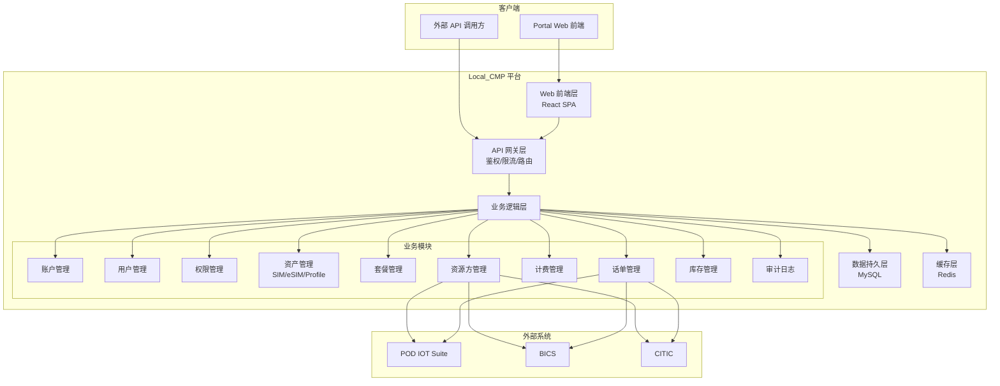
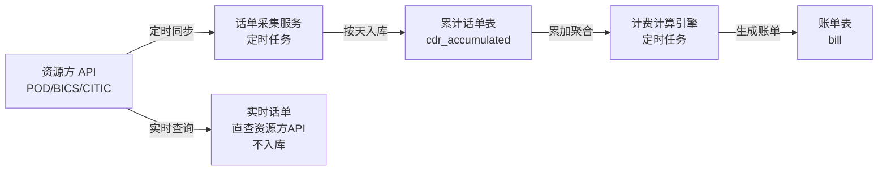
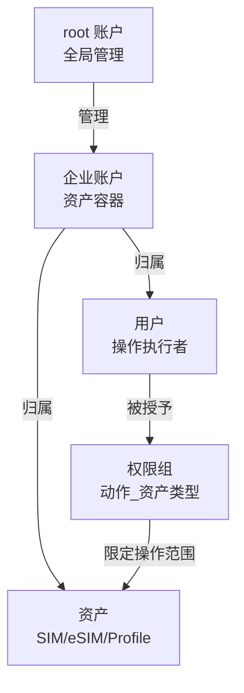
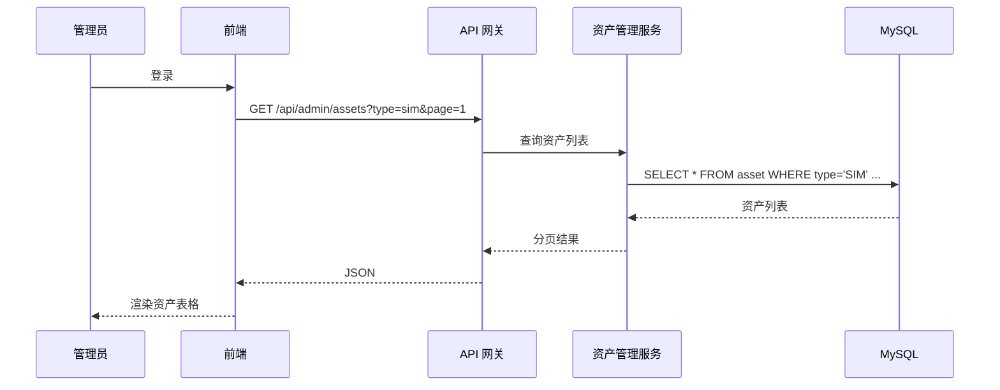
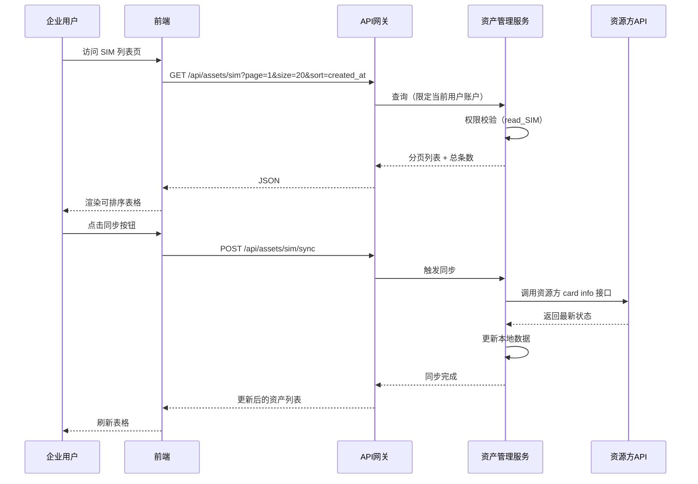
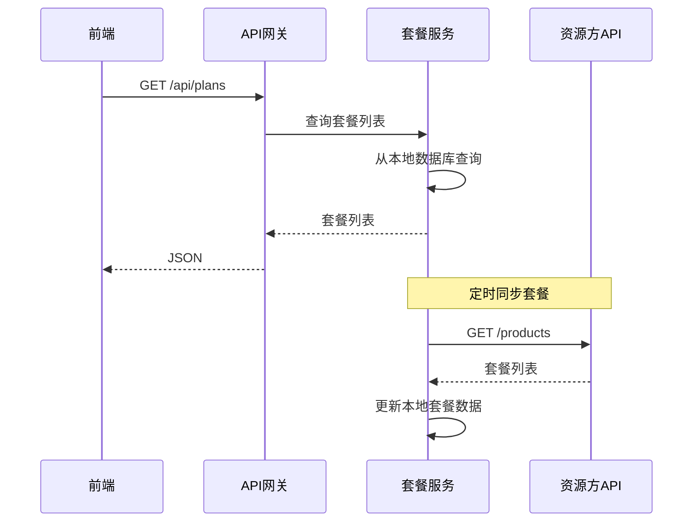

# Local_CMP 连接管理平台 — 技术设计文档

**Feature Name:** cmp-doc-redesign  
**Updated:** 2026-06-23  
**Based on:** `CMP需求说明(V1.0.2).docx`

---

## Description

Local_CMP 是一个面向企业客户的物联网连接管理平台（Connectivity Management Platform）。平台通过对接上游资源方（POD、BICS、CITIC），向下游企业客户提供统一的 SIM/eSIM 生命周期管理、套餐订阅、话单查询及计费服务。系统采用"可视化 Portal + 开放式 API"双通道交互模式。

---

## Architecture

### 系统架构



### 数据流 — 话单采集与计费



### 权限模型



---

## Components and Interfaces

### 1. 管理员首页

**路由:** `/admin/dashboard`  
**所需权限:** ADMIN_ALL

#### 字段布局

| 区域 | 字段 | 说明 |
|------|------|------|
| 资产列表 | ICCID / EID | 资产唯一标识，优先 SIM 类型 |
| 资产列表 | 资产名称 | 可编辑 |
| 资产列表 | 资产类型 | SIM / eSIM / Profile |
| 资产列表 | 归属账户 | 资产所属企业账户名 |
| 资产列表 | 状态 | 启用/停用/已删除 |
| 资产列表 | 套餐名称 | 当前订阅的商用套餐 |
| 资产列表 | 创建时间 | 资产入库时间 |
| 操作栏 | 删除（单条） | 删除选中资产 |
| 操作栏 | 批量删除 | 勾选多条后批量删除 |
| 操作栏 | 筛选 | 按资产类型/状态/账户筛选 |

#### 数据流



---

### 2. 企业用户首页

**路由:** `/dashboard`  
**所需权限:** read_SIM / read_eSIM / read_Profile / read_CDR / read_Bill

#### 字段布局

| 区域 | 字段 | 说明 |
|------|------|------|
| 仪表盘卡片 | 总资产数 | 按类型分 SIM/eSIM/Profile |
| 仪表盘卡片 | 活跃资产数 | 状态为启用 |
| 仪表盘卡片 | 本月总流量 | 当月累计 roundedBytes |
| 仪表盘卡片 | 本月费用 | 当月累计账单金额 |
| 连接管理 > 按月 | 月份、总流量、总费用 | 按月聚合统计 |
| 连接管理 > 按天 | 日期、流量、费用 | 按天聚合统计 |
| 连接管理 > 按套餐 | 套餐名称、资产数、总流量、总费用 | 按套餐聚合统计 |

#### 仪表盘配置

仪表盘卡片类型通过配置表 `dashboard_config` 动态管理，支持新增/移除卡片类型。

---

### 3. SIM 资产列表页

**路由:** `/assets/sim`  
**所需权限:** read_SIM

#### 字段布局（可配置表头）

| 字段 | 类型 | 排序 | 筛选 | 说明 |
|------|------|------|------|------|
| ICCID | string | YES | YES | 资产唯一标识 |
| 项目名称 | string | YES | YES | 关联项目 |
| 归属用户 | string | YES | YES | 一级企业客户 |
| MSISDN | string | YES | YES | 电话号码 |
| 状态 | enum | YES | YES | 启用/停用/暂停 |
| 商用套餐名称 | string | YES | YES | 当前订阅套餐 |
| 创建时间 | datetime | YES | NO | 资产入库时间 |
| 激活时间 | datetime | YES | NO | 首次激活时间 |
| 最后同步时间 | datetime | YES | NO | 最近一次向资源方同步 |
| 绑定套餐时间 | datetime | YES | NO | 最近一次套餐绑定 |
| 卡片型号 | string | NO | YES | 插拔卡/工规卡/车规卡 |
| 卡片类型 | string | NO | YES | SGP.22/SGP.32 |

#### 数据流



---

### 4. SIM 单资产详情页

**路由:** `/assets/sim/:iccid`  
**所需权限:** read_SIM（查看）/ manage_SIM（操作）/ read_CDR（获取话单）

#### 字段布局

**资产信息区：**

| 字段 | 说明 |
|------|------|
| 归属企业客户 | 一级客户名 |
| 资产名称 | 可编辑（需 manage_SIM） |
| 项目名称 | 关联项目 |
| MSISDN | 电话号码 |
| 商用套餐名称 | 当前订阅的套餐 |

**链接信息区：**

| 字段 | 说明 |
|------|------|
| 状态 | 启用/停用/暂停 |
| 资产创建时间 | - |
| 绑定套餐时间 | - |
| 最近激活时间 | - |
| 最后登网时间 | - |
| 登录网络名称 | MCC+MNC |

**操作按钮：**

| 按钮 | 所需权限 | 行为 |
|------|----------|------|
| 修改资产状态 | manage_SIM | 弹出状态选择对话框（启用/停用/暂停） |
| 修改资产名称 | manage_SIM | 弹出内联编辑框 |
| 获取话单 | read_CDR | 跳转至该资产的话单查询页 |
| 查看资产详情 | read_SIM | 触发向资源方同步 card info |
| 删除资产 | delete_SIM | 二次确认后删除 |

---

### 5. eSIM 资产列表页

**路由:** `/assets/esim`  
**所需权限:** read_eSIM

#### 字段布局（可配置表头）

| 字段 | 类型 | 排序 | 筛选 | 说明 |
|------|------|------|------|------|
| EID | string | YES | YES | eSIM 设备唯一标识 |
| eSIM 名称 | string | YES | YES | 资产名称 |
| 用户 | string | YES | YES | 归属一级企业客户 |
| Profile 数量 | integer | YES | NO | 该 eSIM 上的 Profile 总数 |
| 启用 Profile ID | string | YES | NO | 当前激活的 Profile ICCID |
| 状态 | enum | YES | YES | 启用/停用 |
| Profile 类型 | enum | NO | YES | bootprofile / virtual |
| 激活日期 | datetime | YES | NO | Profile 绑定套餐时间 |

---

### 6. eSIM 单资产详情页

**路由:** `/assets/esim/:eid`  
**所需权限:** read_eSIM（查看）/ manage_eSIM（操作）

#### 字段布局

**eSIM 基本信息区：**

| 字段 | 说明 |
|------|------|
| EID | eSIM 设备标识 |
| eSIM 名称 | 可编辑 |
| 状态 | 启用/停用 |
| 归属客户 | 一级企业客户 |

**eSIM Profiles 列表区：**

| 字段 | 说明 |
|------|------|
| ICCID | Profile 标识 |
| Profile 类型 | bootprofile / virtual |
| 状态 | 启用/停用 |
| 归属网络 | 网络运营商 |
| 套餐名称 | 订阅套餐 |
| 绑定时间 | 套餐绑定时间 |

**启用 Profile 信息区：**
- 当前激活的 Profile 详细信息

**链接信息区：**
- 与 SIM 详情页相同的链接信息字段

**设备信息区：**

| 字段 | 说明 |
|------|------|
| IMEI | 设备标识 |
| 设备型号 | - |

**操作按钮：**
- 修改资产状态、修改资产名称、获取话单（与 SIM 详情页一致）

---

### 7. Profile 资产列表页

**路由:** `/assets/profile`  
**所需权限:** read_Profile

#### 字段布局（可配置表头）

| 字段 | 类型 | 排序 | 筛选 | 说明 |
|------|------|------|------|------|
| ICCID | string | YES | YES | Profile 唯一标识 |
| 资产名称 | string | YES | YES | - |
| 归属企业用户 | string | YES | YES | - |
| 项目名称 | string | YES | YES | - |
| MSISDN | string | YES | YES | - |
| eSIM Profile 状态 | enum | YES | YES | 启用/停用/待激活 |
| 归属网络 | string | NO | YES | - |
| 链接状态 | enum | NO | YES | 已链接/未链接 |
| 所属 EID | string | YES | NO | 归属的 eSIM 设备 |
| 套餐名称 | string | YES | YES | - |

---

### 8. Profile 单资产详情页

**路由:** `/assets/profile/:iccid`  
**所需权限:** read_Profile（查看）/ manage_Profile（操作）

字段布局与操作按钮与 SIM 详情页一致。

---

### 9. 资源方列表页

**路由:** `/resource-providers`  
**所需权限:** manage_Resource

#### 字段布局

| 字段 | 类型 | 说明 |
|------|------|------|
| 资源方名称 | string | POD / BICS / CITIC |
| 资源方类型 | enum | 流量型 / 资源池 |
| API Endpoint | string | 资源方 API 地址 |
| 状态 | enum | 启用/停用 |
| 密码状态 | enum | 正常/即将过期/已过期 |
| 密码最后更新时间 | datetime | - |
| API Key | string（脱敏） | 显示 `****` + 后4位 |
| 操作 | buttons | 编辑/启停用（二次确认） |

---

### 10. 资源方添加/编辑页

**路由:** `/resource-providers/add` / `/resource-providers/:id/edit`  
**所需权限:** manage_Resource

#### 字段布局

| 字段 | 类型 | 必填 | 说明 |
|------|------|------|------|
| 资源方名称 | string | YES | 唯一 |
| 资源方类型 | select | YES | 流量型/资源池 |
| API 基础 URL | url | YES | 如 `https://api.podiotsuite.com` |
| 用户名 | string | YES | API 认证用户名 |
| API Password | password | YES | 加密存储 |
| API Key | password | NO | 加密存储 |
| 密码有效期（天） | integer | YES | 如 90 |
| 状态 | switch | YES | 启用/停用 |

---

### 11. 套餐列表页

**路由:** `/plans`  
**所需权限:** read_Plan

#### 字段布局

| 字段 | 类型 | 排序 | 说明 |
|------|------|------|------|
| 套餐编码 | string | YES | 取值于资源方套餐 ID |
| 套餐名称 | string | YES | 与资源方侧保持一致 |
| 资源方 | string | YES | 所属资源方 |
| 套餐价格 | decimal | YES | 周期内固定费用 |
| 套外价格 | decimal | NO | 超出套餐的单位价格 |
| 容量 | bigint | YES | 套餐内包含流量（字节） |
| 计费周期 | enum | YES | 月/季度/年 |
| 更新周期 | enum | YES | - |
| 状态 | enum | YES | 可用/停用 |

#### 数据流



---

### 12. 套餐添加页

**路由:** `/plans/add`  
**所需权限:** subscribe_Plan（管理员级别）

| 字段 | 类型 | 必填 | 说明 |
|------|------|------|------|
| 套餐编码 | string | YES | 资源方侧套餐 ID |
| 套餐名称 | string | YES | 与资源方一致 |
| 资源方 | select | YES | POD/BICS/CITIC |
| 套餐价格 | decimal | YES | 参与计费运算 |
| 套外价格 | decimal | NO | 参与计费运算 |
| 容量 | bigint | YES | 参与计费运算，单位字节 |
| 计费周期 | select | YES | 参与计费运算 |
| 更新周期 | select | YES | 参与计费运算 |

---

### 13. 话单累计 — 月

**路由:** `/cdr/monthly`  
**所需权限:** read_CDR

#### 字段布局

| 字段 | 类型 | 排序 | 说明 |
|------|------|------|------|
| 月份 | string | YES | YYYY-MM |
| 资产 ID（ICCID） | string | YES | - |
| 总流量 | bigint | YES | 当月累加 roundedBytes |
| 总费用 | decimal | YES | 当月费用 |

> 数据源：按资产累加 `cdr_accumulated` 表中当月所有单天数据。

---

### 14. 话单累计 — 天

**路由:** `/cdr/daily`  
**所需权限:** read_CDR

#### 字段布局

| 字段 | 类型 | 排序 | 说明 |
|------|------|------|------|
| 日期 | date | YES | YYYY-MM-DD |
| 资产 ID（ICCID） | string | YES | - |
| MSISDN | string | NO | - |
| 套餐名称 | string | NO | - |
| 流量 | bigint | YES | roundedBytes |
| 费用 | decimal | NO | 可配置隐藏 |

> 数据源：`cdr_accumulated` 表中每个资产单天的记录。

---

### 15. 话单累计 — 套餐

**路由:** `/cdr/by-plan`  
**所需权限:** read_CDR

#### 字段布局

| 字段 | 类型 | 排序 | 说明 |
|------|------|------|------|
| 套餐名称 | string | YES | - |
| 资产数量 | integer | NO | - |
| 总流量 | bigint | YES | 按套餐 ID 聚合 |
| 总费用 | decimal | YES | - |

> 数据源：按套餐 ID 聚合 `cdr_accumulated` 表数据。

---

### 16. 实时话单

**路由:** `/cdr/realtime`  
**所需权限:** read_CDR

#### 字段布局

| 字段 | 类型 | 说明 |
|------|------|------|
| 时间 | datetime | startTime — endTime |
| ICCID | string | 资产标识 |
| MSISDN | string | - |
| IMEI | string | 设备标识 |
| 类型 | string | data/sms/voice |
| 流量 | integer | roundedBytes |
| IP 地址 | string | - |
| 网络 | string | MCC+MNC |
| 套餐名称 | string | 使用的套餐 |
| 费用 | decimal | - |
| 币种 | string | EUR/CNY |

> 数据源：实时调用资源方 `/cdr` 接口，不入库，按时间降序排列，支持时间段筛选和分页。

---

## Data Models

### 核心实体关系

```mermaid
erDiagram
    Account ||--o{ User : "归属"
    Account ||--o{ Asset : "归属"
    Account ||--o{ Account : "reseller 管理子客户"
    User }o--o{ Role : "被授予"
    Asset ||--o| Plan : "订阅"
    Asset ||--o{ CDR : "产生"
    Plan }o--|| ResourceProvider : "归属"
    CDR }o--|| ResourceProvider : "来源于"
    Bill }o--|| Account : "归属"
    Bill }o--|| Asset : "关联"
    AuditLog }o--|| User : "操作人"

    Account {
        bigint id PK
        string code UK "全局唯一编码"
        string name
        tinyint status "0-启用 1-停用"
        bigint parent_id FK "上级账户（二级客户）"
        datetime created_at
        datetime updated_at
    }

    User {
        bigint id PK
        bigint account_id FK
        string username UK
        string password_hash
        string email
        string phone
        tinyint status "0-启用 1-停用"
        datetime last_login_at
        datetime created_at
        datetime updated_at
    }

    Role {
        bigint id PK
        string code UK "如 read_SIM"
        string name
        string description
    }

    UserRole {
        bigint user_id FK
        bigint role_id FK
    }

    Asset {
        bigint id PK
        bigint account_id FK
        string iccid UK "SIM/Profile 标识"
        string eid "eSIM 设备标识（可为空）"
        string asset_name
        string asset_type "SIM/eSIM/Profile"
        string msisdn
        string imei
        string project_name
        string card_model "插拔卡/工规卡/车规卡"
        string card_type "SGP.22/SGP.32"
        string profile_type "bootprofile/virtual"
        bigint plan_id FK "当前订阅套餐"
        tinyint status "0-启用 1-停用 2-暂停"
        string network_name "登录网络名称"
        datetime activated_at
        datetime last_sync_at
        datetime last_network_at
        datetime plan_bound_at
        datetime created_at
        datetime updated_at
    }

    ResourceProvider {
        bigint id PK
        string name UK
        string type "流量型/资源池"
        string api_base_url
        string api_username
        string api_password_enc
        string api_key_enc
        int pw_validity_period
        tinyint status "0-启用 1-停用"
        tinyint pw_status "0-正常 1-即将过期 2-已过期"
        datetime last_pw_update_time
        datetime created_at
        datetime updated_at
    }

    Plan {
        bigint id PK
        bigint resource_id FK
        string code UK "资源方套餐 ID"
        string name
        decimal price "套餐价格"
        decimal overage_price "套外价格"
        bigint capacity "容量（字节）"
        string billing_cycle "月/季度/年"
        string update_cycle
        tinyint status "0-可用 1-停用"
        datetime created_at
        datetime updated_at
    }

    Subscription {
        bigint id PK
        bigint asset_id FK
        bigint plan_id FK
        bigint resource_subscription_id "资源方侧订阅ID"
        datetime bound_at "首次绑定时间"
        datetime current_cycle_start
        tinyint status "0-活跃 1-暂停 2-已退订"
        datetime created_at
        datetime updated_at
    }

    CDRAccumulated {
        bigint id PK
        bigint asset_id FK
        bigint plan_id FK
        bigint resource_id FK
        date record_date "话单日期"
        bigint rounded_bytes
        string mcc
        string mnc
        string ip_address
        datetime start_time
        datetime end_time
        datetime bill_time
        datetime created_at
        INDEX idx_asset_date(asset_id, record_date)
        INDEX idx_plan_date(plan_id, record_date)
    }

    Bill {
        bigint id PK
        bigint account_id FK
        bigint asset_id FK
        bigint plan_id FK
        string billing_period "YYYY-MM"
        decimal plan_cost "套餐费用"
        decimal overage_cost "套外费用"
        decimal total_cost "总费用"
        bigint total_usage "总用量"
        tinyint status "0-未结算 1-已结算 2-已调整"
        datetime created_at
        datetime updated_at
    }

    AuditLog {
        bigint id PK
        bigint user_id FK
        bigint account_id FK
        string target_type "操作对象类型"
        string target_id "操作对象ID"
        string action_type "操作类型"
        string request_summary "请求摘要"
        string response_result "响应结果"
        text before_value "操作前值"
        text after_value "操作后值"
        string source_ip
        string trace_id UK
        datetime created_at
    }

    DashboardConfig {
        bigint id PK
        bigint account_id FK
        string card_type "仪表盘卡片类型"
        int sort_order
        tinyint visible
    }

    ResourcePwHistory {
        bigint id PK
        bigint resource_id FK
        string old_password_hash
        datetime changed_at
    }
```

### 索引策略

| 表 | 索引 | 用途 |
|----|------|------|
| `plan` | `(price, overage_price, capacity, update_cycle, billing_cycle)` | 计费运算联合索引 |
| `cdr_accumulated` | `(asset_id, record_date)` | 按资产+日期查询话单 |
| `cdr_accumulated` | `(plan_id, record_date)` | 按套餐聚合话单 |
| `asset` | `(account_id, asset_type, status)` | 资产列表筛选 |
| `audit_log` | `(created_at)` | 按时间范围查询 |
| `audit_log` | `(user_id, created_at)` | 按操作人查询 |
| `bill` | `(account_id, billing_period)` | 按账户+周期查询账单 |

---

## API Endpoint Design

### 认证

所有外部 API 请求 header 中携带 token：
```
Authorization: Bearer <token>
```

### API 端点列表

#### 账户

| 方法 | 路径 | 权限 | 说明 |
|------|------|------|------|
| POST | `/api/accounts` | manage_Account | 创建二级企业客户 |
| GET | `/api/accounts` | ADMIN_ALL | 查询账户列表 |
| GET | `/api/accounts/{id}` | manage_Account | 查询账户详情 |
| PUT | `/api/accounts/{id}` | manage_Account | 更新账户信息 |
| PUT | `/api/accounts/{id}/disable` | manage_Account | 停用账户 |
| DELETE | `/api/accounts/{id}` | ADMIN_ALL | 删除账户（需满足前置条件） |

#### 用户

| 方法 | 路径 | 权限 | 说明 |
|------|------|------|------|
| POST | `/api/users` | manage_User | 创建用户 |
| GET | `/api/users` | manage_User | 查询用户列表 |
| GET | `/api/users/{id}` | manage_User | 查询用户详情 |
| PUT | `/api/users/{id}` | manage_User | 更新用户信息 |
| PUT | `/api/users/{id}/reset-password` | manage_User | 重置密码 |
| PUT | `/api/users/{id}/disable` | manage_User | 停用用户 |

#### 权限

| 方法 | 路径 | 权限 | 说明 |
|------|------|------|------|
| GET | `/api/roles` | manage_Role | 查询可用权限列表 |
| POST | `/api/users/{id}/roles` | manage_Role | 为用户分配权限 |
| DELETE | `/api/users/{id}/roles/{roleId}` | manage_Role | 移除用户权限 |

#### 资源方

| 方法 | 路径 | 权限 | 说明 |
|------|------|------|------|
| GET | `/api/resource-providers` | manage_Resource | 查询资源方列表 |
| POST | `/api/resource-providers` | manage_Resource | 添加资源方 |
| GET | `/api/resource-providers/{id}` | manage_Resource | 查询资源方详情 |
| PUT | `/api/resource-providers/{id}` | manage_Resource | 更新资源方配置 |
| PUT | `/api/resource-providers/{id}/enable` | manage_Resource | 启用资源方 |
| PUT | `/api/resource-providers/{id}/disable` | manage_Resource | 停用资源方 |

#### 资产 — SIM

| 方法 | 路径 | 权限 | 说明 |
|------|------|------|------|
| GET | `/api/assets/sim` | read_SIM | SIM 列表（分页/排序/筛选） |
| GET | `/api/assets/sim/{iccid}` | read_SIM | SIM 详情 |
| PUT | `/api/assets/sim/{iccid}/status` | manage_SIM | 修改资产状态 |
| PUT | `/api/assets/sim/{iccid}/name` | manage_SIM | 修改资产名称 |
| POST | `/api/assets/sim/{iccid}/sync` | read_SIM | 向资源方同步 card info |
| POST | `/api/assets/sim/{iccid}/cdr` | read_CDR | 获取该资产话单 |
| DELETE | `/api/assets/sim/{iccid}` | delete_SIM | 删除资产 |

#### 资产 — eSIM

| 方法 | 路径 | 权限 | 说明 |
|------|------|------|------|
| GET | `/api/assets/esim` | read_eSIM | eSIM 列表 |
| GET | `/api/assets/esim/{eid}` | read_eSIM | eSIM 详情 |
| PUT | `/api/assets/esim/{eid}/status` | manage_eSIM | 修改状态 |
| PUT | `/api/assets/esim/{eid}/name` | manage_eSIM | 修改名称 |
| DELETE | `/api/assets/esim/{eid}` | delete_eSIM | 删除 |

#### 资产 — Profile

| 方法 | 路径 | 权限 | 说明 |
|------|------|------|------|
| GET | `/api/assets/profile` | read_Profile | Profile 列表 |
| GET | `/api/assets/profile/{iccid}` | read_Profile | Profile 详情 |
| PUT | `/api/assets/profile/{iccid}/status` | manage_Profile | 修改状态 |
| PUT | `/api/assets/profile/{iccid}/name` | manage_Profile | 修改名称 |
| DELETE | `/api/assets/profile/{iccid}` | delete_Profile | 删除 |

#### 套餐

| 方法 | 路径 | 权限 | 说明 |
|------|------|------|------|
| GET | `/api/plans` | read_Plan | 套餐列表（含套餐编码和名称） |
| POST | `/api/plans` | subscribe_Plan | 添加套餐 |
| GET | `/api/plans/{id}` | read_Plan | 套餐详情 |
| PUT | `/api/plans/{id}` | subscribe_Plan | 更新套餐 |
| POST | `/api/assets/{iccid}/subscribe` | subscribe_Plan | 为资产订阅套餐 |
| POST | `/api/assets/{iccid}/suspend` | subscribe_Plan | 暂停资产套餐 |
| POST | `/api/assets/{iccid}/unsuspend` | subscribe_Plan | 恢复资产套餐 |
| POST | `/api/assets/{iccid}/unsubscribe` | subscribe_Plan | 退订资产套餐 |
| POST | `/api/assets/{iccid}/resubscribe` | subscribe_Plan | 更换套餐 |

#### 话单

| 方法 | 路径 | 权限 | 说明 |
|------|------|------|------|
| GET | `/api/cdr/monthly?month=YYYY-MM` | read_CDR | 月累计话单 |
| GET | `/api/cdr/daily?date=YYYY-MM-DD` | read_CDR | 天累计话单 |
| GET | `/api/cdr/by-plan?month=YYYY-MM` | read_CDR | 按套餐累计话单 |
| GET | `/api/cdr/realtime?iccid=X&start=T1&end=T2&page=1&size=20` | read_CDR | 实时话单查询 |

#### 账单

| 方法 | 路径 | 权限 | 说明 |
|------|------|------|------|
| GET | `/api/bills?period=YYYY-MM` | read_Bill | 账单列表 |
| GET | `/api/bills/{id}` | read_Bill | 账单详情 |
| PUT | `/api/bills/{id}/adjust` | adjust_Bill | 调整账单金额 |

#### 仪表盘

| 方法 | 路径 | 权限 | 说明 |
|------|------|------|------|
| GET | `/api/dashboard/summary` | read_SIM/read_eSIM/read_Profile | 仪表盘汇总数据 |
| GET | `/api/dashboard/config` | manage_User | 仪表盘配置 |
| PUT | `/api/dashboard/config` | manage_User | 更新仪表盘配置 |

#### 库存

| 方法 | 路径 | 权限 | 说明 |
|------|------|------|------|
| GET | `/api/inventory/report` | ADMIN_ALL | 库存报表 |

#### 审计日志

| 方法 | 路径 | 权限 | 说明 |
|------|------|------|------|
| GET | `/api/audit-logs?user=X&type=Y&from=T1&to=T2&page=1` | ADMIN_ALL | 审计日志查询 |

#### 认证

| 方法 | 路径 | 说明 |
|------|------|------|
| POST | `/api/auth/login` | 用户登录，返回 token |
| POST | `/api/auth/logout` | 用户登出，token 失效 |
| POST | `/api/auth/refresh` | 刷新 token |

---

## Correctness Properties

### 数据一致性

1. **资产归属唯一性**: 每个 asset 的 `account_id` 不可为 NULL，且迁移需事务保证。
2. **账户删除级联校验**: 删除账户前必须事务性检查 `asset`、`user`、`bill` 表中无关联记录。
3. **套餐订阅幂等性**: 同一资产同一套餐重复订阅请求返回已有订阅记录。
4. **计费周期幂等性**: 同一计费周期的账单仅生成一次，通过 `billing_period + asset_id` 唯一约束保障。

### 时序约束

1. **Token 过期**: token 有效期内复用，过期后需重新获取。
2. **密码有效期扫描**: 每天凌晨执行一次，扫描条件为 `NOW() > last_pw_update_time + pw_validity_period - 3天`。
3. **话单采集顺序**: 累计话单先于账单生成，账单依赖累计话单聚合结果。
4. **计费周期触发**: 仅当 `NOW() > current_cycle_start + billing_cycle` 时触发新周期。

### 权限校验约束

1. **非特权用户**: 所有查询和操作范围限定于 `user.account_id`。
2. **资源方操作校验**: 状态为停用或密码已过期时拒绝调用。
3. **二次确认**: 资源方启停用、资产删除、账单调整操作必须二次确认。

---

## Error Handling

### 错误码体系

| HTTP Code | Error Code | 场景 | 用户提示 |
|-----------|------------|------|----------|
| 400 | INVALID_PARAM | 请求参数格式错误 | "请求参数格式有误，请检查后重试" |
| 401 | TOKEN_EXPIRED | token 过期 | "登录已过期，请重新登录" |
| 401 | INVALID_CREDENTIALS | 用户名或密码错误 | "用户名或密码错误" |
| 403 | PERMISSION_DENIED | 无操作权限 | "无此操作权限" |
| 403 | ACCOUNT_DISABLED | 账户已停用 | "账户已停用，无法执行此操作" |
| 403 | USER_DISABLED | 用户已停用 | "用户已停用，请联系管理员" |
| 404 | NOT_FOUND | 资源不存在 | "请求的资源不存在" |
| 409 | ACCOUNT_NOT_EMPTY | 删除账户时有依赖数据 | "账户下仍有资产、用户或未结算账单，无法删除" |
| 409 | RESOURCE_DISABLED | 资源方已停用 | "资源方已停用，操作无法执行" |
| 409 | PASSWORD_EXPIRED | 资源方密码已过期 | "资源方密码已过期，请联系管理员更新" |
| 409 | DUPLICATE_PASSWORD | 新密码与历史密码重复 | "新密码不可与最近三次密码重复" |
| 500 | INTERNAL_ERROR | 服务器内部错误 | "服务器内部错误，请稍后重试" |
| 502 | RESOURCE_UNAVAILABLE | 资源方不可用 | "上游服务暂时不可用，请稍后重试" |
| 503 | SERVICE_UNAVAILABLE | 系统维护中 | "系统维护中，请稍后重试" |

### 统一错误响应格式

```json
{
  "error": {
    "code": "PERMISSION_DENIED",
    "message": "无此操作权限",
    "trace_id": "a1b2c3d4-e5f6-7890-abcd-ef1234567890",
    "timestamp": "2026-06-23T10:30:00Z"
  }
}
```

### 边界场景处理

| 场景 | 处理策略 |
|------|----------|
| 资源方 API 超时 | 重试 3 次（指数退避），失败后返回 502 并记录告警 |
| 定时任务执行失败 | 自动重试 3 次，仍失败则触发告警并标记任务状态 |
| 实时话单查询超大数据集 | 强制分页，单页最大 100 条，默认 20 条 |
| token 即将过期 | 前端在 token 剩余 5 分钟时自动调用 `/api/auth/refresh` |
| 并发资产状态修改 | 乐观锁，基于 `updated_at` 版本号校验 |
| 批量删除部分失败 | 事务回滚全部操作，返回失败详情 |

---

## Test Strategy

### 测试层级

| 层级 | 范围 | 工具 | 覆盖目标 |
|------|------|------|----------|
| 单元测试 | 业务逻辑层各 service 方法 | JUnit / pytest | 核心业务逻辑 80%+ |
| 集成测试 | API 端点 + 数据库 | Spring Boot Test / pytest + TestClient | 所有 API 端点 |
| 契约测试 | 资源方 API 对接 | Pact / WireMock | 资源方接口契约 |
| E2E 测试 | Portal 关键流程 | Playwright / Cypress | 核心用户旅程 |

### 关键测试用例

#### 账户管理

- 创建账户生成唯一编码
- 停用账户后拒绝新增用户和资产分配
- 删除有资产的账户返回 ACCOUNT_NOT_EMPTY 错误
- 删除空账户成功

#### 权限校验

- 非 ADMIN_ALL 用户只能查看本账户数据
- 无 manage_SIM 权限用户无法修改 SIM 状态
- root 账户可查看全平台数据

#### 套餐订阅与计费

- 订阅套餐后 `subscription` 记录创建，`plan_bound_at` 记录
- 单月套餐费用计算 = 套餐价格 + (套外价格 x 超出容量)
- 跨周期计费按累计容量判断，第 3 个月累计超出才产生套外费用
- 计费周期到期触发新周期

#### 话单

- 累计话单按天正确入库
- 月话单正确聚合天数据
- 实时话单不入库且支持分页
- 资源方不可用时话单采集失败告警

#### 安全

- 密码不可逆加密，无法从数据库直接读取明文
- 敏感字段脱敏展示
- 过期 token 被拒绝
- 修改密码后旧 token 失效

---

## References

[^1]: (Original Document) — `CMP需求说明(V1.0.2).docx` from [local_cmp](https://github.com/YangYang990706/local_cmp)
[^2]: (POD API) — [IOT Suite Swagger UI](https://podiotsuite.com)
