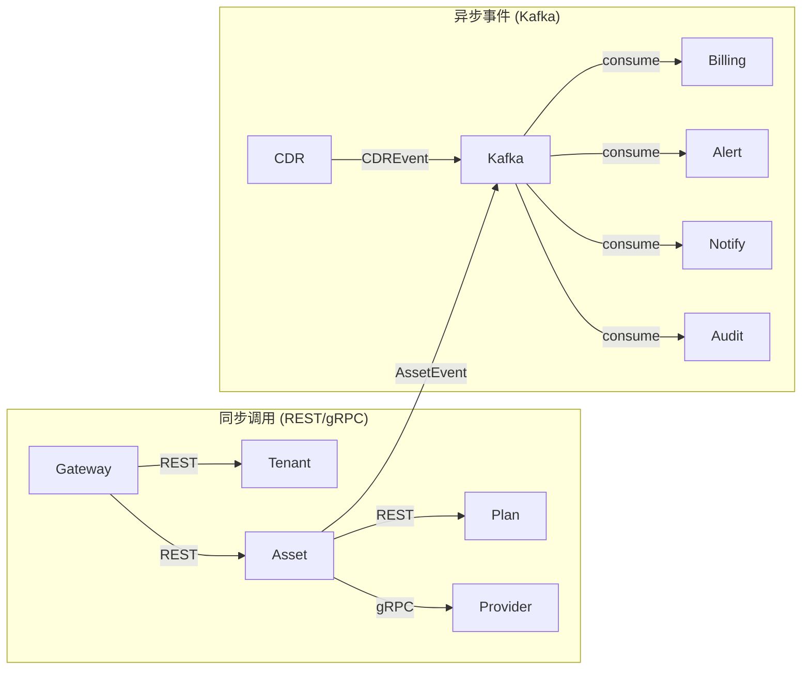
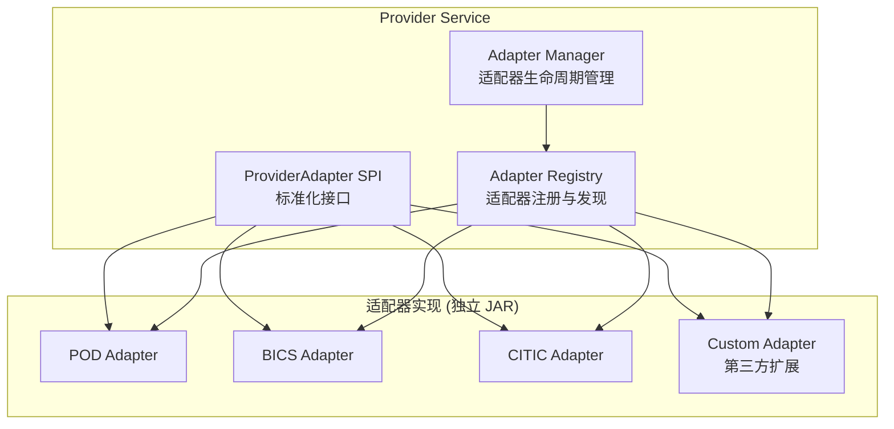
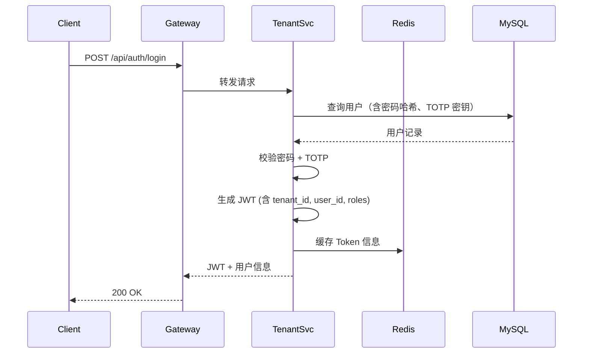
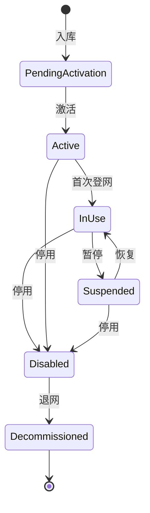
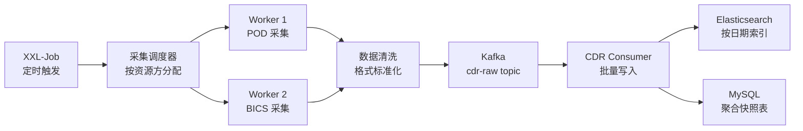
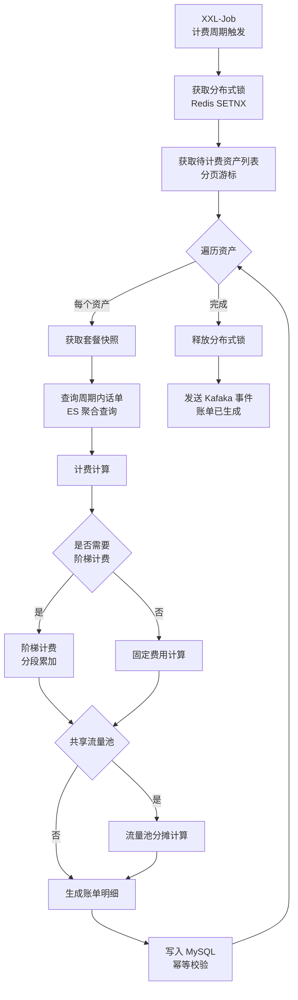
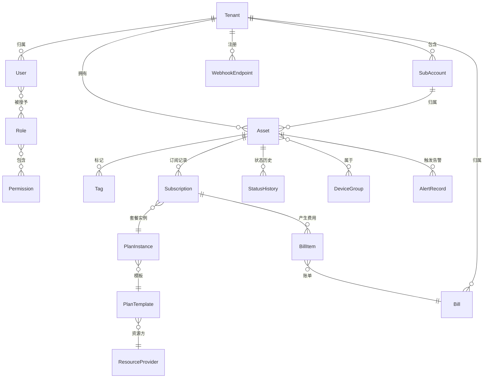

# CMP-NG 连接管理平台 V3 — 技术设计文档

**Feature Name:** cmp-platform-v3  
**Updated:** 2026-06-23  
**Tech Stack:** Java 17 / Spring Boot 3 / Spring Cloud / React 18 / MySQL 8 / Redis 7 / Kafka / Elasticsearch

---

## Description

CMP-NG 是面向企业客户的下一代物联网连接管理平台，以微服务架构构建，核心差异化竞争力为：(1) 多资源方适配器热插拔框架；(2) 独立可水平扩展的计费引擎；(3) 支持百万级 IoT 设备管理。平台采用前后端分离架构，前端为 React SPA，后端为 Spring Cloud 微服务集群。

---

## Architecture

### 整体架构

```mermaid
graph TB
    subgraph "客户端层"
        Portal["React SPA<br/>Portal 前端"]
        MobileApp["企业业务系统<br/>API 调用方"]
    end

    subgraph "网关层"
        Nginx["Nginx<br/>反向代理 / TLS"]
        Gateway["Spring Cloud Gateway<br/>认证 / 限流 / 路由 / 日志"]
    end

    subgraph "核心业务服务层"
        TenantSvc["Tenant Service<br/>租户/用户/角色管理"]
        AssetSvc["Asset Service<br/>SIM/eSIM/Profile 生命周期"]
        GroupSvc["Group Service<br/>设备群组管理"]
        PlanSvc["Plan Service<br/>套餐模板与订阅"]
        ProviderSvc["Provider Service<br/>资源方适配器框架"]
        CDRSvc["CDR Service<br/>话单采集与查询"]
        BillingSvc["Billing Service<br/>计费引擎"]
        AlertSvc["Alert Service<br/>监控与告警"]
        ReportSvc["Report Service<br/>数据分析与报表"]
        NotifySvc["Notification Service<br/>多通道通知"]
        AuditSvc["Audit Service<br/>审计日志"]
    end

    subgraph "基础设施层"
        MySQL["MySQL 8<br/>核心业务数据"]
        Redis["Redis 7<br/>缓存 / 分布式锁 / Token"]
        Kafka["Kafka<br/>消息队列 / 事件总线"]
        ES["Elasticsearch<br/>话单存储 / 日志检索"]
        MinIO["MinIO<br/>报表文件 / 对象存储"]
        XXLJob["XXL-Job<br/>分布式任务调度"]
        Prometheus["Prometheus + Grafana<br/>监控与可观测"]
    end

    subgraph "外部系统"
        POD["POD"]
        BICS["BICS"]
        CITIC["CITIC"]
        Email["邮件服务"]
        SMS["短信服务"]
    end

    Portal --> Nginx
    MobileApp --> Nginx
    Nginx --> Gateway
    Gateway --> TenantSvc
    Gateway --> AssetSvc
    Gateway --> GroupSvc
    Gateway --> PlanSvc
    Gateway --> ProviderSvc
    Gateway --> CDRSvc
    Gateway --> BillingSvc
    Gateway --> AlertSvc
    Gateway --> ReportSvc
    Gateway --> AuditSvc

    TenantSvc --> MySQL
    TenantSvc --> Redis
    AssetSvc --> MySQL
    AssetSvc --> Redis
    AssetSvc --> Kafka
    GroupSvc --> MySQL
    PlanSvc --> MySQL
    ProviderSvc --> MySQL
    ProviderSvc --> POD
    ProviderSvc --> BICS
    ProviderSvc --> CITIC
    CDRSvc --> Kafka
    CDRSvc --> ES
    CDRSvc --> MySQL
    BillingSvc --> Kafka
    BillingSvc --> MySQL
    BillingSvc --> Redis
    AlertSvc --> Kafka
    AlertSvc --> MySQL
    ReportSvc --> ES
    ReportSvc --> MySQL
    ReportSvc --> MinIO
    NotifySvc --> Kafka
    NotifySvc --> Email
    NotifySvc --> SMS
    NotifySvc --> MySQL
    AuditSvc --> Kafka
    AuditSvc --> ES

    XXLJob --> CDRSvc
    XXLJob --> BillingSvc
    XXLJob --> ProviderSvc
    XXLJob --> ReportSvc
```



### 微服务通信拓扑



### 资源方适配器框架



---

## Technology Stack

| 层次 | 技术选型 | 说明 |
|------|----------|------|
| 后端框架 | Spring Boot 3 + Spring Cloud 2023 | 微服务基础框架 |
| API 网关 | Spring Cloud Gateway | 统一入口、认证、限流、路由 |
| 服务注册 | Nacos | 服务注册/发现/配置中心 |
| 认证授权 | Spring Security + OAuth2 + JWT | 无状态认证 |
| ORM | MyBatis-Plus | 数据访问层 |
| 数据库 | MySQL 8 (InnoDB) | 核心业务数据 |
| 缓存 | Redis 7 (Lettuce) | Token/会话/热数据缓存 |
| 消息队列 | Apache Kafka | 事件驱动、削峰填谷 |
| 搜索引擎 | Elasticsearch 8 | 话单存储、日志检索、报表聚合 |
| 对象存储 | MinIO | 报表文件、导出文件 |
| 任务调度 | XXL-Job | 分布式定时任务 |
| 链路追踪 | Micrometer + Zipkin | 分布式追踪 |
| 监控 | Prometheus + Grafana | 指标采集与可视化 |
| 前端框架 | React 18 + TypeScript | SPA |
| 前端状态管理 | Zustand | 轻量状态管理 |
| UI 组件库 | Ant Design 5 | 企业级组件库 |
| 前端构建 | Vite 5 | 快速构建 |
| API 文档 | SpringDoc OpenAPI 3 | Swagger UI |

---

## Components and Interfaces

### 1. Gateway Service (API 网关)

**职责：** 统一入口、JWT 校验、租户级限流、请求日志、Trace ID 注入。

**核心过滤器链：**

| 序号 | 过滤器 | 说明 |
|------|--------|------|
| 1 | TraceFilter | 生成/传播 Trace ID |
| 2 | RateLimitFilter | 基于租户 ID 的令牌桶限流 |
| 3 | AuthFilter | JWT 解析与校验，注入 SecurityContext |
| 4 | TenantFilter | 从 JWT 提取租户 ID，写入请求上下文 |
| 5 | AuditFilter | 记录请求摘要到 Kafka |
| 6 | RouteFilter | 按路径转发到下游微服务 |

**限流配置：**

| 接口组 | 默认 QPS | 可配置 |
|--------|----------|--------|
| `/api/auth/**` | 20/分钟 | 否 |
| `/api/assets/**` | 200/秒 | 是 |
| `/api/cdr/**` | 100/秒 | 是 |
| `/api/bills/**` | 50/秒 | 是 |
| 其他 | 500/秒 | 是 |

---

### 2. Tenant Service (租户服务)

**职责：** 租户 CRUD、子账户管理、用户管理、角色与权限管理、认证。

**核心 API：**

| 方法 | 路径 | 说明 |
|------|------|------|
| POST | `/api/auth/login` | 登录（支持密码 + TOTP） |
| POST | `/api/auth/refresh` | 刷新 Token |
| POST | `/api/auth/logout` | 登出（Token 加入黑名单） |
| GET | `/api/tenants` | 租户列表（ADMIN） |
| POST | `/api/tenants` | 创建租户 |
| GET | `/api/tenants/{id}` | 租户详情 |
| PUT | `/api/tenants/{id}/branding` | 白标配置（Logo/主题色） |
| PUT | `/api/tenants/{id}/disable` | 停用租户 |
| GET | `/api/tenants/{id}/sub-accounts` | 子账户列表 |
| POST | `/api/tenants/{id}/sub-accounts` | 创建子账户 |
| GET | `/api/users` | 用户列表 |
| POST | `/api/users` | 创建用户 |
| PUT | `/api/users/{id}/disable` | 停用用户 |
| PUT | `/api/users/{id}/password` | 修改密码 |
| PUT | `/api/users/{id}/totp` | 启用/禁用 TOTP |
| GET | `/api/roles` | 角色列表 |
| POST | `/api/users/{id}/roles` | 为用户分配角色 |

**数据流 — 登录认证：**



---

### 3. Asset Service (资产服务)

**职责：** SIM/eSIM/Profile 全生命周期管理、状态机流转、标签管理、批量操作。

**核心 API：**

| 方法 | 路径 | 说明 |
|------|------|------|
| GET | `/api/assets/sim` | SIM 列表（分页/筛选/排序） |
| GET | `/api/assets/sim/{iccid}` | SIM 详情 |
| PUT | `/api/assets/sim/{iccid}/status` | 修改 SIM 状态 |
| PUT | `/api/assets/sim/{iccid}/name` | 修改 SIM 名称 |
| POST | `/api/assets/sim/batch-status` | 批量状态变更 |
| POST | `/api/assets/sim/batch-export` | 批量导出 Excel |
| GET | `/api/assets/sim/{iccid}/history` | SIM 状态变更历史 |
| POST | `/api/assets/sim/{iccid}/tags` | 添加标签 |
| GET | `/api/assets/esim` | eSIM 列表 |
| GET | `/api/assets/esim/{eid}` | eSIM 详情 |
| GET | `/api/assets/profile` | Profile 列表 |
| GET | `/api/assets/profile/{iccid}` | Profile 详情 |

**SIM 状态机：**



---

### 4. Provider Service (资源方适配器服务)

**职责：** 资源方适配器生命周期管理、API 调用代理、健康检查。

**适配器接口 (ProviderAdapter SPI)：**

```java
public interface ProviderAdapter {
    /** 资源方标识 */
    String getProviderCode();
    /** 初始化适配器（连接池、配置加载） */
    void init(ProviderConfig config);
    /** 获取/刷新 Token */
    TokenResponse getToken();
    /** 获取套餐列表 */
    List<PlanInfo> getPlans();
    /** 为资产订阅套餐 */
    SubscribeResult subscribe(String iccid, SubscribeRequest req);
    /** 暂停资产 */
    void suspend(String iccid);
    /** 恢复资产 */
    void unsuspend(String iccid);
    /** 退订套餐 */
    void unsubscribe(String iccid, String subscriptionId);
    /** 更换套餐 */
    SubscribeResult resubscribe(String iccid, ResubscribeRequest req);
    /** 获取资产详情 */
    AssetInfo getAssetInfo(String iccid);
    /** 获取话单 */
    List<CDRecord> getCDRs(String iccid, TimeRange range);
    /** 健康检查 */
    HealthStatus healthCheck();
    /** 销毁适配器 */
    void destroy();
}
```

**适配器注册与发现：**

| 机制 | 说明 |
|------|------|
| SPI 发现 | 通过 Java SPI (`META-INF/services`) 自动发现类路径中的适配器实现 |
| 动态加载 | 支持将新适配器 JAR 放入指定目录后热加载（自定义 ClassLoader） |
| 配置管理 | 每个适配器的连接参数（URL/用户名/密码/超时）存储在数据库，通过 Nacos 动态刷新 |
| 隔离性 | 每个适配器实例独立连接池，互不影响 |

**核心 API：**

| 方法 | 路径 | 说明 |
|------|------|------|
| GET | `/api/providers` | 资源方列表 |
| POST | `/api/providers` | 注册资源方 |
| PUT | `/api/providers/{id}` | 更新配置 |
| PUT | `/api/providers/{id}/enable` | 启用 |
| PUT | `/api/providers/{id}/disable` | 停用 |
| GET | `/api/providers/{id}/health` | 健康检查 |
| POST | `/api/providers/{id}/adapters/reload` | 热重载适配器 |

---

### 5. Plan Service (套餐服务)

**职责：** 套餐模板管理、套餐实例创建、订阅管理。

**核心 API：**

| 方法 | 路径 | 说明 |
|------|------|------|
| GET | `/api/plans/templates` | 套餐模板列表 |
| POST | `/api/plans/templates` | 创建模板 |
| GET | `/api/plans/instances` | 套餐实例列表 |
| POST | `/api/assets/{iccid}/subscribe` | 订阅套餐 |
| POST | `/api/assets/{iccid}/suspend` | 暂停 |
| POST | `/api/assets/{iccid}/unsuspend` | 恢复 |
| POST | `/api/assets/{iccid}/unsubscribe` | 退订 |
| POST | `/api/assets/{iccid}/resubscribe` | 更换套餐 |
| POST | `/api/groups/{id}/batch-subscribe` | 群组批量订阅 |

---

### 6. CDR Service (话单服务)

**职责：** 话单采集调度、实时查询代理、话单存储与检索。

**核心 API：**

| 方法 | 路径 | 说明 |
|------|------|------|
| GET | `/api/cdr/monthly` | 月累计话单 |
| GET | `/api/cdr/daily` | 天累计话单 |
| GET | `/api/cdr/by-plan` | 按套餐聚合 |
| GET | `/api/cdr/realtime` | 实时话单查询（代理资源方） |
| POST | `/api/cdr/recollect` | 话单补采（指定时间/资产范围） |

**话单采集流水线：**



---

### 7. Billing Service (计费引擎)

**职责：** 多维计费计算、账单生成、账单预览、账单调整。

**计费计算流程：**



**核心 API：**

| 方法 | 路径 | 说明 |
|------|------|------|
| GET | `/api/bills` | 账单列表（按周期筛选） |
| GET | `/api/bills/{id}` | 账单详情（含明细） |
| POST | `/api/bills/preview` | 账单预览（预估） |
| PUT | `/api/bills/{id}/adjust` | 账单调整 |
| POST | `/api/bills/trigger` | 手动触发计费（管理员） |

---

### 8. Group Service (设备群组服务)

**职责：** 群组 CRUD、动态成员匹配、群组级批量操作。

**核心 API：**

| 方法 | 路径 | 说明 |
|------|------|------|
| GET | `/api/groups` | 群组列表 |
| POST | `/api/groups` | 创建群组 |
| GET | `/api/groups/{id}` | 群组详情（含成员列表和聚合统计） |
| PUT | `/api/groups/{id}` | 更新群组（含动态规则） |
| DELETE | `/api/groups/{id}` | 删除群组 |
| POST | `/api/groups/{id}/members` | 手动添加成员 |
| DELETE | `/api/groups/{id}/members/{assetId}` | 移除成员 |
| POST | `/api/groups/{id}/batch-status` | 批量状态变更 |
| POST | `/api/groups/{id}/batch-subscribe` | 批量套餐订阅 |

---

### 9. Alert Service (告警服务)

**职责：** 告警规则引擎、告警触发与分级、告警历史管理。

**告警规则模型：**

| 字段 | 类型 | 说明 |
|------|------|------|
| 规则名称 | string | 唯一 |
| 监控对象 | enum | 资产/群组/资源方/租户 |
| 触发条件 | expression | 如 `offline_duration > 30min` |
| 告警级别 | enum | CRITICAL / WARNING / INFO |
| 静默时段 | cron | 告警抑制时间窗口 |
| 通知渠道 | array | 站内/邮件/短信/Webhook |
| 状态 | enum | 启用/停用 |

**核心 API：**

| 方法 | 路径 | 说明 |
|------|------|------|
| GET | `/api/alerts/rules` | 告警规则列表 |
| POST | `/api/alerts/rules` | 创建规则 |
| GET | `/api/alerts/history` | 告警历史 |
| PUT | `/api/alerts/history/{id}/ack` | 确认告警 |

---

### 10. Report Service (报表服务)

**职责：** 预设报表生成、自定义报表、定时投递、导出。

**预设报表：**

| 报表 | 数据源 | 刷新频率 |
|------|--------|----------|
| 资产概览 | MySQL | 实时 |
| 话单趋势 | Elasticsearch | 小时级 |
| 费用分析 | MySQL | 天级 |
| 资源方质量 | MySQL + ES | 天级 |
| 租户活跃度 | MySQL | 天级 |

**核心 API：**

| 方法 | 路径 | 说明 |
|------|------|------|
| GET | `/api/reports/asset-overview` | 资产概览报表 |
| GET | `/api/reports/cdr-trend` | 话单趋势报表 |
| GET | `/api/reports/cost-analysis` | 费用分析报表 |
| GET | `/api/reports/provider-quality` | 资源方质量报表 |
| POST | `/api/reports/export` | 导出报表（Excel/PDF） |
| POST | `/api/reports/subscriptions` | 报表订阅（定时投递） |

---

### 11. Notification Service (通知服务)

**职责：** 多渠道消息投递、通知偏好管理。

**核心 API：**

| 方法 | 路径 | 说明 |
|------|------|------|
| GET | `/api/notifications` | 站内消息列表 |
| PUT | `/api/notifications/{id}/read` | 标记已读 |
| GET | `/api/notifications/preferences` | 通知偏好 |
| PUT | `/api/notifications/preferences` | 更新偏好 |

---

### 12. Audit Service (审计服务)

**职责：** 审计日志采集、存储、查询、导出。

**核心 API：**

| 方法 | 路径 | 说明 |
|------|------|------|
| GET | `/api/audit-logs` | 审计日志查询（分页/筛选） |
| GET | `/api/audit-logs/export` | 导出审计日志 |
| GET | `/api/audit-logs/stats` | 审计统计 |

---

## Data Models

### 核心实体关系



### 关键表设计

#### tenant (租户)

| 字段 | 类型 | 约束 | 说明 |
|------|------|------|------|
| id | BIGINT | PK AUTO_INCREMENT | 主键 |
| code | VARCHAR(64) | UK NOT NULL | 全局唯一编码 |
| name | VARCHAR(128) | NOT NULL | 租户名称 |
| type | TINYINT | NOT NULL | 0-普通 1-Reseller |
| status | TINYINT | NOT NULL | 0-启用 1-停用 |
| logo_url | VARCHAR(512) | | 白标 Logo |
| theme_color | VARCHAR(16) | | 主题色 |
| portal_title | VARCHAR(128) | | Portal 标题 |
| created_at | DATETIME | NOT NULL | |
| updated_at | DATETIME | NOT NULL | |

#### asset (资产 — 统一 SIM/eSIM/Profile)

| 字段 | 类型 | 约束 | 说明 |
|------|------|------|------|
| id | BIGINT | PK AUTO_INCREMENT | |
| tenant_id | BIGINT | FK NOT NULL | 所属租户 |
| sub_account_id | BIGINT | FK | 所属子账户 |
| iccid | VARCHAR(32) | UK | SIM/Profile 标识 |
| eid | VARCHAR(32) | | eSIM 设备标识 |
| asset_type | VARCHAR(16) | NOT NULL | SIM/eSIM/Profile |
| asset_name | VARCHAR(128) | | |
| msisdn | VARCHAR(32) | | |
| imei | VARCHAR(32) | | |
| card_model | VARCHAR(32) | | 插拔卡/工规卡/车规卡 |
| card_type | VARCHAR(16) | | SGP.22/SGP.32 |
| profile_type | VARCHAR(16) | | bootprofile/virtual |
| status | VARCHAR(16) | NOT NULL | 状态机当前状态 |
| provider_id | BIGINT | FK | 归属资源方 |
| network_mcc | VARCHAR(8) | | |
| network_mnc | VARCHAR(8) | | |
| activated_at | DATETIME | | 首次激活时间 |
| last_sync_at | DATETIME | | 最后同步时间 |
| last_network_at | DATETIME | | 最后登网时间 |
| created_at | DATETIME | NOT NULL | |
| updated_at | DATETIME | NOT NULL | |
| INDEX | idx_tenant_type_status | (tenant_id, asset_type, status) | 列表筛选 |
| INDEX | idx_eid | (eid) | eSIM 关联查询 |

#### resource_provider (资源方)

| 字段 | 类型 | 约束 | 说明 |
|------|------|------|------|
| id | BIGINT | PK AUTO_INCREMENT | |
| code | VARCHAR(32) | UK NOT NULL | 资源方编码 |
| name | VARCHAR(64) | NOT NULL | |
| type | VARCHAR(16) | NOT NULL | 流量型/资源池 |
| adapter_class | VARCHAR(256) | NOT NULL | 适配器全限定类名 |
| api_base_url | VARCHAR(256) | NOT NULL | |
| api_username | VARCHAR(128) | | |
| api_password_enc | VARCHAR(256) | | 加密存储 |
| api_key_enc | VARCHAR(512) | | 加密存储 |
| pw_validity_days | INT | NOT NULL | 密码有效期 |
| pw_status | TINYINT | NOT NULL | 0-正常 1-即将过期 2-已过期 |
| last_pw_update | DATETIME | | |
| status | TINYINT | NOT NULL | 0-启用 1-停用 2-异常 |
| connect_timeout | INT | DEFAULT 5000 | 连接超时(ms) |
| read_timeout | INT | DEFAULT 30000 | 读取超时(ms) |
| max_connections | INT | DEFAULT 20 | 连接池大小 |
| health_check_interval | INT | DEFAULT 60 | 健康检查间隔(秒) |
| created_at | DATETIME | NOT NULL | |
| updated_at | DATETIME | NOT NULL | |

#### plan_template (套餐模板)

| 字段 | 类型 | 约束 | 说明 |
|------|------|------|------|
| id | BIGINT | PK AUTO_INCREMENT | |
| provider_id | BIGINT | FK NOT NULL | 归属资源方 |
| name | VARCHAR(128) | NOT NULL | 模板名称 |
| billing_mode | VARCHAR(16) | NOT NULL | FIXED/TIERED/POOL/COMPOSITE |
| base_price | DECIMAL(12,4) | NOT NULL | 基础价格 |
| billing_cycle | VARCHAR(8) | NOT NULL | MONTH/QUARTER/YEAR/CUSTOM |
| cycle_days | INT | | 自定义天数 |
| capacity | BIGINT | | 套餐容量(字节) |
| overage_unit_price | DECIMAL(12,4) | | 套外单价(每MB) |
| tier_config | JSON | | 阶梯计费配置 |
| currency | VARCHAR(8) | DEFAULT CNY | 币种 |
| status | TINYINT | NOT NULL | 0-草稿 1-已发布 2-已停用 |
| created_at | DATETIME | NOT NULL | |
| updated_at | DATETIME | NOT NULL | |

#### plan_instance (套餐实例快照)

| 字段 | 类型 | 约束 | 说明 |
|------|------|------|------|
| id | BIGINT | PK AUTO_INCREMENT | |
| template_id | BIGINT | FK NOT NULL | 关联模板 |
| template_snapshot | JSON | NOT NULL | 模板参数快照 |
| created_at | DATETIME | NOT NULL | |

#### subscription (订阅记录)

| 字段 | 类型 | 约束 | 说明 |
|------|------|------|------|
| id | BIGINT | PK AUTO_INCREMENT | |
| asset_id | BIGINT | FK NOT NULL | 资产 |
| plan_instance_id | BIGINT | FK NOT NULL | 套餐实例 |
| provider_subscription_id | VARCHAR(128) | | 资源方侧订阅ID |
| status | VARCHAR(16) | NOT NULL | ACTIVE/SUSPENDED/UNSUBSCRIBED |
| bound_at | DATETIME | NOT NULL | 首次绑定时间 |
| current_cycle_start | DATETIME | | 当前计费周期起始 |
| current_cycle_end | DATETIME | | 当前计费周期结束 |
| created_at | DATETIME | NOT NULL | |
| updated_at | DATETIME | NOT NULL | |
| INDEX | idx_asset_status | (asset_id, status) | |

#### bill (账单)

| 字段 | 类型 | 约束 | 说明 |
|------|------|------|------|
| id | BIGINT | PK AUTO_INCREMENT | |
| tenant_id | BIGINT | FK NOT NULL | 归属租户 |
| billing_period | VARCHAR(16) | NOT NULL | 计费周期标识 |
| total_plan_cost | DECIMAL(12,4) | NOT NULL | 套餐总费用 |
| total_overage_cost | DECIMAL(12,4) | NOT NULL | 套外总费用 |
| total_cost | DECIMAL(12,4) | NOT NULL | 总费用 |
| currency | VARCHAR(8) | NOT NULL | 币种 |
| status | VARCHAR(16) | NOT NULL | PENDING/CONFIRMED/ADJUSTED |
| confirmed_at | DATETIME | | |
| created_at | DATETIME | NOT NULL | |
| UNIQUE | uk_tenant_period | (tenant_id, billing_period) | 幂等保护 |

#### bill_item (账单明细)

| 字段 | 类型 | 约束 | 说明 |
|------|------|------|------|
| id | BIGINT | PK AUTO_INCREMENT | |
| bill_id | BIGINT | FK NOT NULL | 关联账单 |
| asset_id | BIGINT | FK NOT NULL | |
| subscription_id | BIGINT | FK | |
| plan_cost | DECIMAL(12,4) | | |
| overage_cost | DECIMAL(12,4) | | |
| total_cost | DECIMAL(12,4) | NOT NULL | |
| total_usage | BIGINT | | 总用量(字节) |
| UNIQUE | uk_bill_asset | (bill_id, asset_id) | 幂等保护 |

#### alert_rule (告警规则)

| 字段 | 类型 | 约束 | 说明 |
|------|------|------|------|
| id | BIGINT | PK AUTO_INCREMENT | |
| tenant_id | BIGINT | FK NOT NULL | |
| name | VARCHAR(128) | NOT NULL | |
| target_type | VARCHAR(16) | NOT NULL | ASSET/GROUP/PROVIDER/TENANT |
| target_id | BIGINT | | 监控对象 ID |
| condition_expr | VARCHAR(256) | NOT NULL | 触发条件表达式 |
| severity | VARCHAR(8) | NOT NULL | CRITICAL/WARNING/INFO |
| silence_cron | VARCHAR(64) | | 静默时段 |
| notify_channels | JSON | NOT NULL | 通知渠道列表 |
| status | TINYINT | NOT NULL | 0-启用 1-停用 |

#### audit_log (审计日志 — Elasticsearch 存储)

| 字段 | 类型 | 说明 |
|------|------|------|
| id | KEYWORD | 日志 ID |
| user_id | KEYWORD | 操作人 |
| user_name | TEXT | 操作人名称 |
| tenant_id | KEYWORD | 所属租户 |
| target_type | KEYWORD | 操作对象类型 |
| target_id | KEYWORD | 操作对象 ID |
| action | KEYWORD | 操作类型 |
| request_summary | TEXT | 请求摘要 |
| response_code | INTEGER | 响应码 |
| before_value | TEXT | 操作前值 |
| after_value | TEXT | 操作后值 |
| source_ip | IP | 来源 IP |
| user_agent | TEXT | |
| trace_id | KEYWORD | 链路追踪 ID |
| created_at | DATE | 创建时间(日索引) |

---

## Correctness Properties

### 数据一致性

1. **租户隔离**: 所有查询必须携带 `tenant_id` 条件，API 网关层注入，业务层二次校验。
2. **资产归属唯一**: `asset.tenant_id` 不可为空，迁移需事务保证。
3. **计费幂等**: `bill` 表 `(tenant_id, billing_period)` 唯一约束 + `bill_item` 表 `(bill_id, asset_id)` 唯一约束双重保障。
4. **套餐快照不可变**: `plan_instance` 创建后不可修改，确保历史账单可追溯。
5. **订阅生命周期**: 状态变更通过状态机校验，不允许非法跳转。

### 时序约束

1. **话单采集先于计费**: 计费任务在执行前检查相应周期的话单采集任务是否完成。
2. **Token 刷新**: Access Token 有效期 2 小时，Refresh Token 有效期 7 天，过期需重新登录。
3. **计费周期边界**: 仅当 `NOW() > subscription.current_cycle_end` 时触发新周期。
4. **告警静默**: 在静默时段内不发送通知但仍记录告警。

### 并发控制

1. **计费任务**: Redis 分布式锁 + 数据库唯一约束双重保障。
2. **批量操作**: 使用乐观锁（`updated_at` 版本号）防止并发覆盖。
3. **资产状态修改**: 基于状态机的乐观锁校验。

---

## Error Handling

### 统一错误响应

```json
{
  "code": "BILLING_CALCULATION_FAILED",
  "message": "计费计算失败，请稍后重试",
  "trace_id": "a1b2c3d4-e5f6-7890-abcd-ef1234567890",
  "details": [
    {
      "field": "asset_id",
      "reason": "资产不存在或已退网"
    }
  ],
  "timestamp": "2026-06-23T10:30:00Z"
}
```

### 错误码体系

| HTTP | Error Code | 场景 |
|------|------------|------|
| 400 | VALIDATION_ERROR | 参数校验失败 |
| 401 | TOKEN_EXPIRED | Token 过期 |
| 401 | INVALID_CREDENTIALS | 认证失败 |
| 403 | PERMISSION_DENIED | 无权限 |
| 403 | TENANT_DISABLED | 租户已停用 |
| 403 | ACCOUNT_LOCKED | 账户已锁定 |
| 404 | ASSET_NOT_FOUND | 资产不存在 |
| 409 | ASSET_STATUS_CONFLICT | 状态机不允许该操作 |
| 409 | BILL_ALREADY_EXISTS | 账单已存在（幂等） |
| 429 | RATE_LIMIT_EXCEEDED | 请求过于频繁 |
| 502 | PROVIDER_UNAVAILABLE | 资源方不可用 |
| 502 | PROVIDER_TIMEOUT | 资源方超时 |
| 503 | SERVICE_DEGRADED | 服务降级中 |

### 容错策略

| 场景 | 策略 |
|------|------|
| 资源方 API 超时 | 3 次重试(指数退避 1s/2s/4s) → 返回 PROVIDER_TIMEOUT |
| 资源方不可用 (连续 3 次失败) | 自动标记异常 → 触发告警 → 熔断 5 分钟 |
| 话单采集失败 | 3 次重试 → 标记失败 → 支持人工补采 |
| Kafka 投递失败 | 本地缓冲 + 重试 → 死信队列 |
| 计费任务中断 | 断点续传（游标记录已处理资产 ID） |

---

## Test Strategy

### 测试金字塔

| 层级 | 范围 | 工具 | 覆盖率目标 |
|------|------|------|------------|
| 单元测试 | Service 层逻辑 | JUnit 5 + Mockito | 80% |
| 集成测试 | API + DB + Redis | Spring Boot Test + Testcontainers | 核心 API 100% |
| 契约测试 | 资源方接口 | Pact + WireMock | 每个 Provider Adapter |
| 性能测试 | 计费引擎 / 话单写入 | JMeter / K6 | 关键路径 |
| E2E | Portal 核心流程 | Playwright | 核心用户旅程 |

### 关键测试场景

| 场景 | 验证点 |
|------|--------|
| 百万资产列表分页查询 | 响应时间 < 2s，ES 索引正确 |
| 计费引擎 100 万资产计算 | 30 分钟内完成，幂等正确 |
| 资源方适配器热加载 | 加载新适配器不中断已有服务 |
| 多租户隔离 | 租户 A 无法访问租户 B 的数据 |
| 状态机非法跳转 | 拒绝并返回 ASSET_STATUS_CONFLICT |
| Webhook 推送失败重试 | 指数退避最多 5 次，连续 10 次停用 |

---

## Deployment Architecture

### 服务部署拓扑

| 服务 | 实例数 | 内存 | CPU | 说明 |
|------|--------|------|-----|------|
| Gateway | 2 | 1GB | 2C | Nginx + Gateway 同 Pod |
| Tenant Service | 2 | 2GB | 2C | 含认证逻辑 |
| Asset Service | 3 | 2GB | 2C | 高频访问 |
| Provider Service | 2 | 1GB | 2C | 含适配器连接池 |
| Plan Service | 2 | 1GB | 1C | |
| CDR Service | 3 | 4GB | 4C | 含采集调度 |
| Billing Service | 3 | 4GB | 4C | 计算密集型 |
| Group Service | 2 | 1GB | 1C | |
| Alert Service | 2 | 1GB | 1C | |
| Report Service | 2 | 2GB | 2C | |
| Notification | 2 | 1GB | 1C | |
| Audit Service | 2 | 1GB | 2C | ES 写入密集 |
| MySQL | 主从 | 16GB | 8C | |
| Redis | 哨兵 3 节点 | 8GB | 4C | |
| Kafka | 3 Broker | 8GB | 4C | |
| Elasticsearch | 3 Data Node | 16GB | 8C | 话单 + 日志存储 |
| MinIO | 2 | 2GB | 2C | 对象存储 |

---

## References

[^1]: Spring Cloud Gateway — https://spring.io/projects/spring-cloud-gateway
[^2]: Apache Kafka — https://kafka.apache.org
[^3]: XXL-Job — https://www.xuxueli.com/xxl-job
