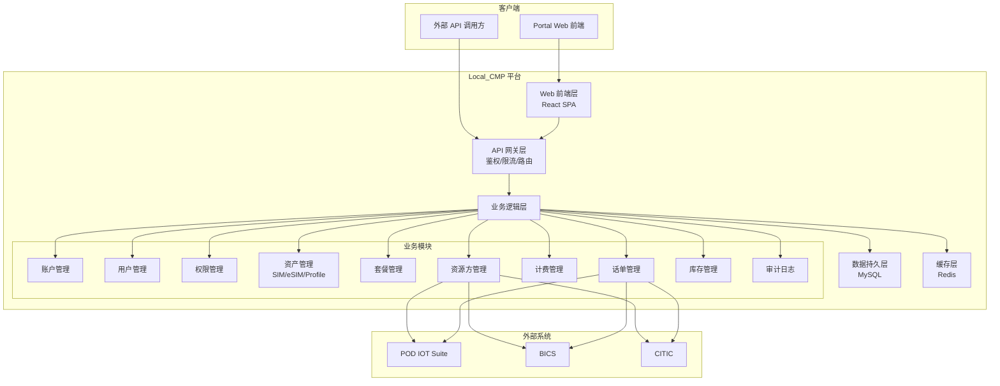
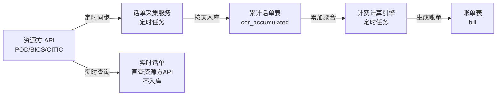
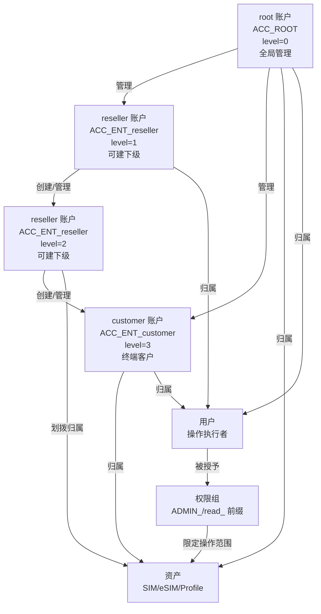
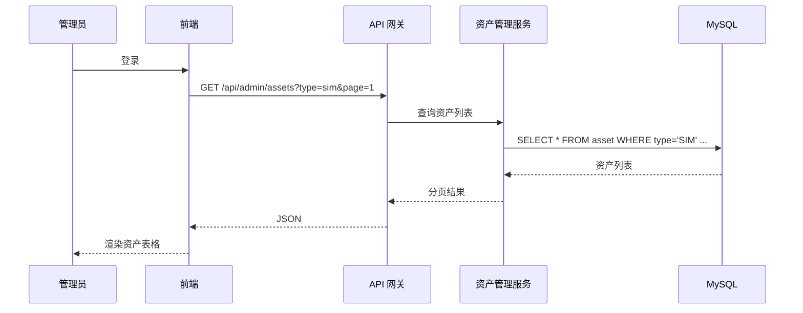
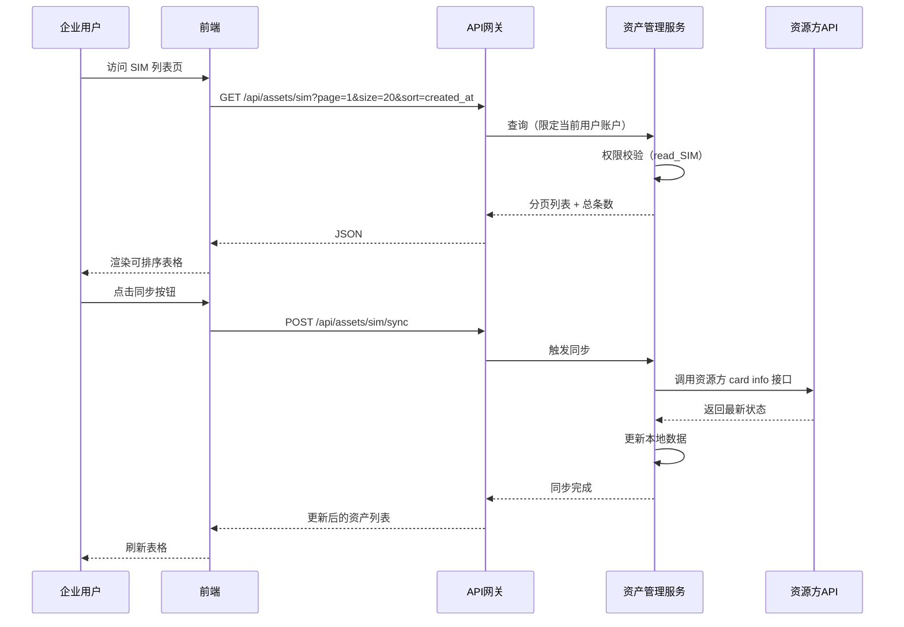
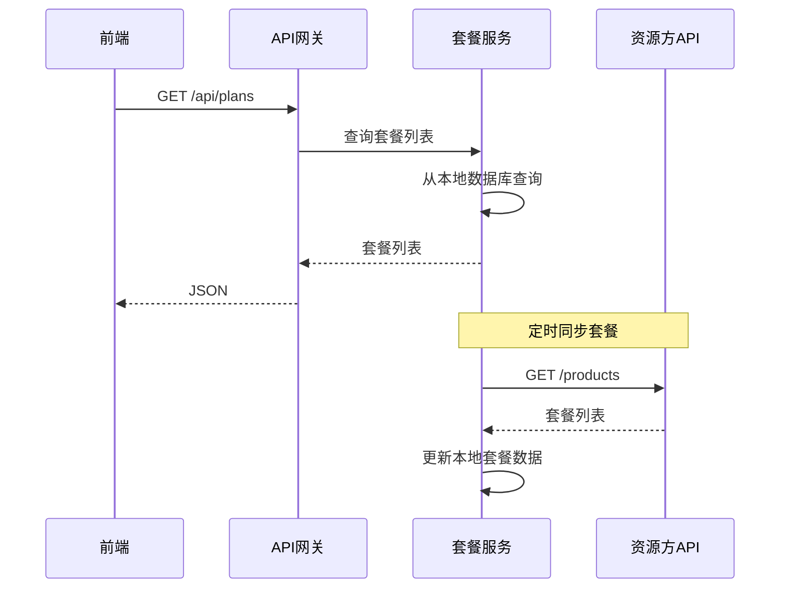
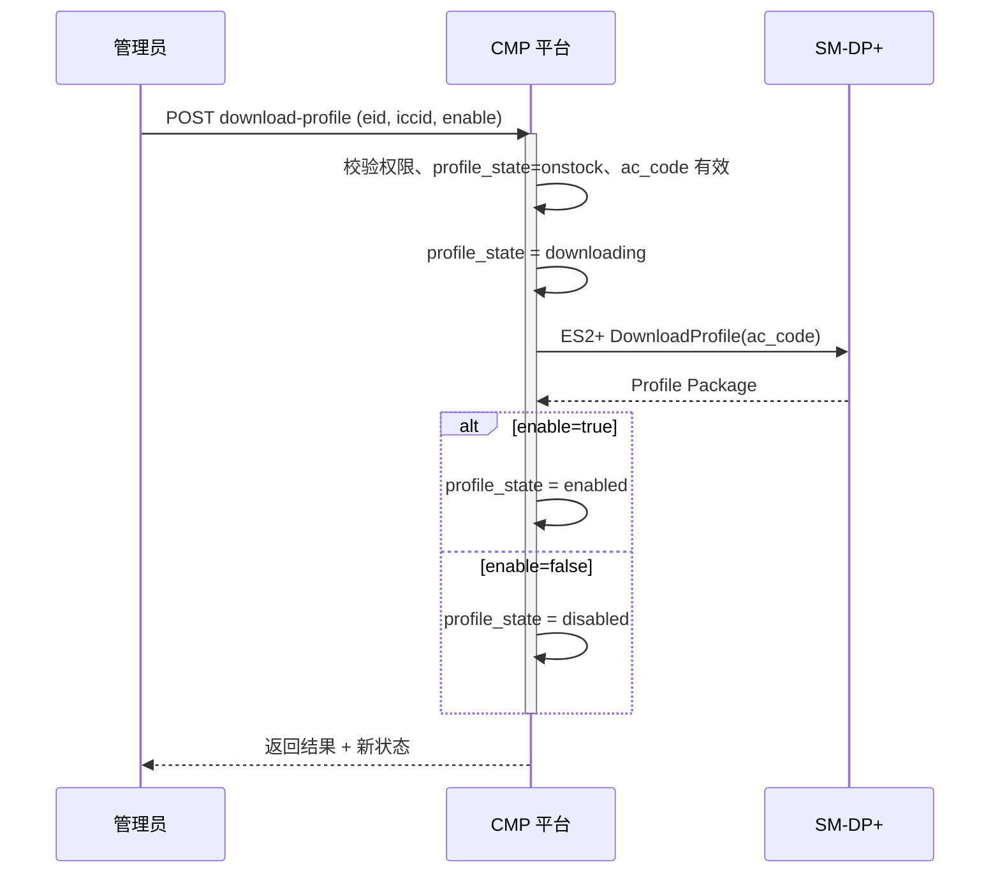

# Local_CMP 连接管理平台 — 技术设计文档

**Feature Name:** cmp-doc-redesign  
**Updated:** 2026-07-13  
**Based on:** `CMP需求说明(V1.0.2).docx` 第三章（账户与权限管理）

---

## Description

Local_CMP 是一个面向企业客户的物联网连接管理平台（Connectivity Management Platform）。平台通过对接上游资源方（POD、BICS、CITIC），向下游企业客户提供统一的 SIM/eSIM 生命周期管理、套餐订阅、话单查询及计费服务。系统采用"可视化 Portal + 开放式 API"双通道交互模式。

**账户层级体系**：平台采用 root → reseller → customer 三级账户类型，reseller 链路最多三层（reseller → reseller → customer）。root 账户（GD 内部）具备全局管理能力，reseller 可创建下级账户并划拨资产，customer 为终端客户不可创建下级。

---

## Architecture

### 系统架构



### 数据流 — 话单采集与计费



### 权限模型



---

## Components and Interfaces

### 1. 管理员首页

**路由:** `/admin/dashboard`  
**所需权限:** ADMIN_ALL

#### 字段布局

| 区域 | 字段 | 说明 |
|------|------|------|
| 资产列表 | ICCID / EID | 资产唯一标识，优先 SIM 类型 |
| 资产列表 | 资产名称 | 可编辑 |
| 资产列表 | 资产类型 | SIM / eSIM / Profile |
| 资产列表 | 归属账户 | 资产所属企业账户名 |
| 资产列表 | 状态 | 启用/停用/已删除 |
| 资产列表 | 套餐名称 | 当前订阅的商用套餐 |
| 资产列表 | 创建时间 | 资产入库时间 |
| 操作栏 | 删除（单条） | 删除选中资产 |
| 操作栏 | 批量删除 | 勾选多条后批量删除 |
| 操作栏 | 筛选 | 按资产类型/状态/账户筛选 |

#### 数据流



---

### 2. 企业用户首页

**路由:** `/dashboard`  
**所需权限:** read_SIM / read_eSIM / read_PROFILE / read_CDR / read_Billing

#### 字段布局

| 区域 | 字段 | 说明 |
|------|------|------|
| 仪表盘卡片 | 总资产数 | 按类型分 SIM/eSIM/Profile |
| 仪表盘卡片 | 活跃资产数 | 状态为启用 |
| 仪表盘卡片 | 本月总流量 | 当月累计 roundedBytes |
| 仪表盘卡片 | 本月费用 | 当月累计账单金额 |
| 连接管理 > 按月 | 月份、总流量、总费用 | 按月聚合统计 |
| 连接管理 > 按天 | 日期、流量、费用 | 按天聚合统计 |
| 连接管理 > 按套餐 | 套餐名称、资产数、总流量、总费用 | 按套餐聚合统计 |

#### 仪表盘配置

仪表盘卡片类型通过配置表 `dashboard_config` 动态管理，支持新增/移除卡片类型。

---

### 3. SIM 资产列表页

**路由:** `/assets/sim`  
**所需权限:** read_SIM

#### 字段布局（可配置表头）

| 字段 | 类型 | 排序 | 筛选 | 说明 |
|------|------|------|------|------|
| ICCID | string | YES | YES | 资产唯一标识 |
| 项目名称 | string | YES | YES | 关联项目 |
| 归属用户 | string | YES | YES | 一级企业客户 |
| MSISDN | string | YES | YES | 电话号码 |
| 状态 | enum | YES | YES | 启用/停用/暂停 |
| 商用套餐名称 | string | YES | YES | 当前订阅套餐 |
| 创建时间 | datetime | YES | NO | 资产入库时间 |
| 激活时间 | datetime | YES | NO | 首次激活时间 |
| 最后同步时间 | datetime | YES | NO | 最近一次向资源方同步 |
| 绑定套餐时间 | datetime | YES | NO | 最近一次套餐绑定 |
| 卡片型号 | string | NO | YES | 插拔卡/工规卡/车规卡 |
| 卡片类型 | string | NO | YES | SGP.22/SGP.32 |

#### 数据流



---

### 4. SIM 单资产详情页

**路由:** `/assets/sim/:iccid`  
**所需权限:** read_SIM（查看）/ ADMIN_SIM（操作）/ read_CDR（获取话单）

#### 字段布局

**资产信息区：**

| 字段 | 说明 |
|------|------|
| 归属企业客户 | 一级客户名 |
| 资产名称 | 可编辑（需 ADMIN_SIM） |
| 项目名称 | 关联项目 |
| MSISDN | 电话号码 |
| 商用套餐名称 | 当前订阅的套餐 |

**链接信息区：**

| 字段 | 说明 |
|------|------|
| 状态 | 启用/停用/暂停 |
| 资产创建时间 | - |
| 绑定套餐时间 | - |
| 最近激活时间 | - |
| 最后登网时间 | - |
| 登录网络名称 | MCC+MNC |

**操作按钮：**

| 按钮 | 所需权限 | 行为 |
|------|----------|------|
| 修改资产状态 | ADMIN_SIM | 弹出状态选择对话框（启用/停用/暂停） |
| 修改资产名称 | ADMIN_SIM | 弹出内联编辑框 |
| 获取话单 | read_CDR | 跳转至该资产的话单查询页 |
| 查看资产详情 | read_SIM | 触发向资源方同步 card info |
| 删除资产 | ADMIN_SIM | 二次确认后删除 |

---

### 5. eSIM 资产列表页

**路由:** `/assets/esim`  
**所需权限:** read_eSIM

#### 字段布局（可配置表头）

| 字段 | 类型 | 排序 | 筛选 | 说明 |
|------|------|------|------|------|
| EID | string | YES | YES | eSIM 设备唯一标识 |
| eSIM 名称 | string | YES | YES | 资产名称 |
| 用户 | string | YES | YES | 归属一级企业客户 |
| Profile 数量 | integer | YES | NO | 该 eSIM 上的 Profile 总数 |
| 启用 Profile ID | string | YES | NO | 当前激活的 Profile ICCID |
| 状态 | enum | YES | YES | 启用/停用 |
| Profile 类型 | enum | NO | YES | bootprofile / virtual |
| 激活日期 | datetime | YES | NO | Profile 绑定套餐时间 |

---

### 6. eSIM 单资产详情页

**路由:** `/assets/esim/:eid`  
**所需权限:** read_eSIM（查看）/ ADMIN_eSIM（操作）

#### 字段布局

**eSIM 基本信息区：**

| 字段 | 说明 |
|------|------|
| EID | eSIM 设备标识 |
| eSIM 名称 | 可编辑 |
| 状态 | 启用/停用 |
| 归属客户 | 一级企业客户 |

**eSIM Profiles 列表区：**

| 字段 | 说明 |
|------|------|
| ICCID | Profile 标识 |
| Profile 类型 | bootprofile / virtual |
| 状态 | 启用/停用 |
| 归属网络 | 网络运营商 |
| 套餐名称 | 订阅套餐 |
| 绑定时间 | 套餐绑定时间 |

**启用 Profile 信息区：**
- 当前激活的 Profile 详细信息

**链接信息区：**
- 与 SIM 详情页相同的链接信息字段

**设备信息区：**

| 字段 | 说明 |
|------|------|
| IMEI | 设备标识 |
| 设备型号 | - |

**操作按钮：**
- 修改资产状态、修改资产名称、获取话单（与 SIM 详情页一致）

---

### 7. Profile 资产列表页

**路由:** `/assets/profile`  
**所需权限:** read_PROFILE

#### 字段布局（可配置表头）

| 字段 | 类型 | 排序 | 筛选 | 说明 |
|------|------|------|------|------|
| ICCID | string | YES | YES | Profile 唯一标识 |
| 资产名称 | string | YES | YES | - |
| 归属企业用户 | string | YES | YES | - |
| 项目名称 | string | YES | YES | - |
| MSISDN | string | YES | YES | - |
| eSIM Profile 状态 | enum | YES | YES | 启用/停用/待激活 |
| 归属网络 | string | NO | YES | - |
| 链接状态 | enum | NO | YES | 已链接/未链接 |
| 所属 EID | string | YES | NO | 归属的 eSIM 设备 |
| 套餐名称 | string | YES | YES | - |

---

### 8. Profile 单资产详情页

**路由:** `/assets/profile/:iccid`  
**所需权限:** read_PROFILE（查看）/ ADMIN_PROFILE（操作）

字段布局与操作按钮与 SIM 详情页一致。

---

### 9. 资源方列表页

**路由:** `/resource-providers`  
**所需权限:** ADMIN_Resource

#### 字段布局

| 字段 | 类型 | 说明 |
|------|------|------|
| 资源方名称 | string | POD / BICS / CITIC |
| 资源方类型 | enum | 流量型 / 资源池 |
| API Endpoint | string | 资源方 API 地址 |
| 状态 | enum | 启用/停用 |
| 密码状态 | enum | 正常/即将过期/已过期 |
| 密码最后更新时间 | datetime | - |
| API Key | string（脱敏） | 显示 `****` + 后4位 |
| 操作 | buttons | 编辑/启停用（二次确认） |

---

### 10. 资源方添加/编辑页

**路由:** `/resource-providers/add` / `/resource-providers/:id/edit`  
**所需权限:** ADMIN_Resource

#### 字段布局

| 字段 | 类型 | 必填 | 说明 |
|------|------|------|------|
| 资源方名称 | string | YES | 唯一 |
| 资源方类型 | select | YES | 流量型/资源池 |
| API 基础 URL | url | YES | 如 `https://api.podiotsuite.com` |
| 用户名 | string | YES | API 认证用户名 |
| API Password | password | YES | 加密存储 |
| API Key | password | NO | 加密存储 |
| 密码有效期（天） | integer | YES | 如 90 |
| 状态 | switch | YES | 启用/停用 |

---

### 11. 套餐列表页

**路由:** `/plans`  
**所需权限:** read_Plan

#### 字段布局

| 字段 | 类型 | 排序 | 说明 |
|------|------|------|------|
| 套餐编码 | string | YES | 取值于资源方套餐 ID |
| 套餐名称 | string | YES | 与资源方侧保持一致 |
| 资源方 | string | YES | 所属资源方 |
| 套餐价格 | decimal | YES | 周期内固定费用 |
| 套外价格 | decimal | NO | 超出套餐的单位价格 |
| 容量 | bigint | YES | 套餐内包含流量（字节） |
| 计费周期 | enum | YES | 月/季度/年 |
| 更新周期 | enum | YES | - |
| 状态 | enum | YES | 可用/停用 |

#### 数据流



---

### 12. 套餐添加页

**路由:** `/plans/add`  
**所需权限:** ADMIN_Plan（管理员级别）

| 字段 | 类型 | 必填 | 说明 |
|------|------|------|------|
| 套餐编码 | string | YES | 资源方侧套餐 ID |
| 套餐名称 | string | YES | 与资源方一致 |
| 资源方 | select | YES | POD/BICS/CITIC |
| 套餐价格 | decimal | YES | 参与计费运算 |
| 套外价格 | decimal | NO | 参与计费运算 |
| 容量 | bigint | YES | 参与计费运算，单位字节 |
| 计费周期 | select | YES | 参与计费运算 |
| 更新周期 | select | YES | 参与计费运算 |

---

### 13. 话单累计 — 月

**路由:** `/cdr/monthly`  
**所需权限:** read_CDR

#### 字段布局

| 字段 | 类型 | 排序 | 说明 |
|------|------|------|------|
| 月份 | string | YES | YYYY-MM |
| 资产 ID（ICCID） | string | YES | - |
| 总流量 | bigint | YES | 当月累加 roundedBytes |
| 总费用 | decimal | YES | 当月费用 |

> 数据源：按资产累加 `cdr_accumulated` 表中当月所有单天数据。

---

### 14. 话单累计 — 天

**路由:** `/cdr/daily`  
**所需权限:** read_CDR

#### 字段布局

| 字段 | 类型 | 排序 | 说明 |
|------|------|------|------|
| 日期 | date | YES | YYYY-MM-DD |
| 资产 ID（ICCID） | string | YES | - |
| MSISDN | string | NO | - |
| 套餐名称 | string | NO | - |
| 流量 | bigint | YES | roundedBytes |
| 费用 | decimal | NO | 可配置隐藏 |

> 数据源：`cdr_accumulated` 表中每个资产单天的记录。

---

### 15. 话单累计 — 套餐

**路由:** `/cdr/by-plan`  
**所需权限:** read_CDR

#### 字段布局

| 字段 | 类型 | 排序 | 说明 |
|------|------|------|------|
| 套餐名称 | string | YES | - |
| 资产数量 | integer | NO | - |
| 总流量 | bigint | YES | 按套餐 ID 聚合 |
| 总费用 | decimal | YES | - |

> 数据源：按套餐 ID 聚合 `cdr_accumulated` 表数据。

---

### 16. 实时话单

**路由:** `/cdr/realtime`  
**所需权限:** read_CDR

#### 字段布局

| 字段 | 类型 | 说明 |
|------|------|------|
| 时间 | datetime | startTime — endTime |
| ICCID | string | 资产标识 |
| MSISDN | string | - |
| IMEI | string | 设备标识 |
| 类型 | string | data/sms/voice |
| 流量 | integer | roundedBytes |
| IP 地址 | string | - |
| 网络 | string | MCC+MNC |
| 套餐名称 | string | 使用的套餐 |
| 费用 | decimal | - |
| 币种 | string | EUR/CNY |

> 数据源：实时调用资源方 `/cdr` 接口，不入库，按时间降序排列，支持时间段筛选和分页。

---

## Data Models

### 核心实体关系

```mermaid
erDiagram
    Account ||--o{ User : "归属"
    Account ||--o{ Asset : "归属"
    Account ||--o{ Account : "reseller 管理子客户"
    User }o--o{ Role : "被授予"
    Asset ||--o| Plan : "订阅"
    Asset ||--o{ CDR : "产生"
    Plan }o--|| ResourceProvider : "归属"
    CDR }o--|| ResourceProvider : "来源于"
    Bill }o--|| Account : "归属"
    Bill }o--|| Asset : "关联"
    AuditLog }o--|| User : "操作人"

    Account {
        bigint id PK
        string code UK "全局唯一编码，按类型前缀生成"
        string name
        string account_type "root/reseller/customer"
        tinyint level "账户层级 0=root 1/2=reseller 2/3=customer"
        bigint parent_id FK "上级账户ID（reseller链路）"
        tinyint status "0-启用 1-停用"
        datetime created_at
        datetime updated_at
    }

    User {
        bigint id PK
        bigint account_id FK
        string username "账户内唯一"
        string password_hash
        string email "密码重置、告警、通知"
        string phone "可选"
        tinyint status "0-启用 1-停用"
        datetime last_login_at
        datetime created_at
        datetime updated_at
    }

    Role {
        bigint id PK
        string code UK "如 ADMIN_SIM, read_SIM, read_only"
        string name
        string description
    }

    UserRole {
        bigint user_id FK
        bigint role_id FK
    }

    Asset {
        bigint id PK
        bigint account_id FK
        string iccid UK "SIM/Profile 标识"
        string eid "eSIM 设备标识（可为空）"
        string asset_name
        string asset_type "SIM/eSIM/Profile"
        string msisdn
        string imei
        string project_name
        string card_model "插拔卡/工规卡/车规卡"
        string card_type "SGP.22/SGP.32"
        string profile_type "bootprofile/virtual"
        bigint plan_id FK "当前订阅套餐"
        tinyint status "0-启用 1-停用 2-暂停"
        string network_name "登录网络名称"
        datetime activated_at
        datetime last_sync_at
        datetime last_network_at
        datetime plan_bound_at
        datetime created_at
        datetime updated_at
    }

    ResourceProvider {
        bigint id PK
        string name UK
        string type "流量型/资源池"
        string api_base_url
        string api_username
        string api_password_enc
        string api_key_enc
        int pw_validity_period
        tinyint status "0-启用 1-停用"
        tinyint pw_status "0-正常 1-即将过期 2-已过期"
        datetime last_pw_update_time
        datetime created_at
        datetime updated_at
    }

    Plan {
        bigint id PK
        bigint resource_id FK
        string code UK "资源方套餐 ID"
        string name
        decimal price "套餐价格"
        decimal overage_price "套外价格"
        bigint capacity "容量（字节）"
        string billing_cycle "月/季度/年"
        string update_cycle
        tinyint status "0-可用 1-停用"
        datetime created_at
        datetime updated_at
    }

    Subscription {
        bigint id PK
        bigint asset_id FK
        bigint plan_id FK
        bigint resource_subscription_id "资源方侧订阅ID"
        datetime bound_at "首次绑定时间"
        datetime current_cycle_start
        tinyint status "0-活跃 1-暂停 2-已退订"
        datetime created_at
        datetime updated_at
    }

    CDRAccumulated {
        bigint id PK
        bigint asset_id FK
        bigint plan_id FK
        bigint resource_id FK
        date record_date "话单日期"
        bigint rounded_bytes
        string mcc
        string mnc
        string ip_address
        datetime start_time
        datetime end_time
        datetime bill_time
        datetime created_at
        INDEX idx_asset_date(asset_id, record_date)
        INDEX idx_plan_date(plan_id, record_date)
    }

    Bill {
        bigint id PK
        bigint account_id FK
        bigint asset_id FK
        bigint plan_id FK
        string billing_period "YYYY-MM"
        decimal plan_cost "套餐费用"
        decimal overage_cost "套外费用"
        decimal total_cost "总费用"
        bigint total_usage "总用量"
        tinyint status "0-未结算 1-已结算 2-已调整"
        datetime created_at
        datetime updated_at
    }

    AuditLog {
        bigint id PK
        bigint user_id FK
        bigint account_id FK
        string target_type "操作对象类型"
        string target_id "操作对象ID"
        string action_type "操作类型"
        string request_summary "请求摘要"
        string response_result "响应结果"
        text before_value "操作前值"
        text after_value "操作后值"
        string source_ip
        string trace_id UK
        datetime created_at
    }

    DashboardConfig {
        bigint id PK
        bigint account_id FK
        string card_type "仪表盘卡片类型"
        int sort_order
        tinyint visible
    }

    ResourcePwHistory {
        bigint id PK
        bigint resource_id FK
        string old_password_hash
        datetime changed_at
    }
```

### 索引策略

| 表 | 索引 | 用途 |
|----|------|------|
| `account` | `(parent_id)` | 查询下级账户 |
| `account` | `(account_type, level)` | 按类型和层级筛选 |
| `account` | `(code)` UNIQUE | 全局唯一编码查找 |
| `plan` | `(price, overage_price, capacity, update_cycle, billing_cycle)` | 计费运算联合索引 |
| `cdr_accumulated` | `(asset_id, record_date)` | 按资产+日期查询话单 |
| `cdr_accumulated` | `(plan_id, record_date)` | 按套餐聚合话单 |
| `asset` | `(account_id, asset_type, status)` | 资产列表筛选 |
| `audit_log` | `(created_at)` | 按时间范围查询 |
| `audit_log` | `(user_id, created_at)` | 按操作人查询 |
| `bill` | `(account_id, billing_period)` | 按账户+周期查询账单 |

---

## API Endpoint Design

### 认证

所有外部 API 请求 header 中携带 token：
```
Authorization: Bearer <token>
```

### API 端点列表

#### 账户

| 方法 | 路径 | 权限 | 说明 |
|------|------|------|------|
| POST | `/api/accounts` | ADMIN_Account | 创建下级企业账户（校验层级合法性） |
| GET | `/api/accounts` | ADMIN_ALL | 查询所有账户列表 |
| GET | `/api/accounts/{id}` | ADMIN_Account | 查询账户详情 |
| GET | `/api/accounts/{id}/children` | ADMIN_Account | 查询下级账户列表（按层级树） |
| GET | `/api/accounts/{id}/asset-summary` | ADMIN_Account | 查询账户及其下级账户的资产汇总（递归聚合） |
| PUT | `/api/accounts/{id}` | ADMIN_Account | 更新账户信息 |
| PUT | `/api/accounts/{id}/disable` | ADMIN_Account | 停用账户（级联停用下级） |
| DELETE | `/api/accounts/{id}` | ADMIN_ALL | 删除账户（需满足前置条件：无资产、无用户、无下级、无未结算账单） |

#### 用户

| 方法 | 路径 | 权限 | 说明 |
|------|------|------|------|
| POST | `/api/users` | ADMIN_User | 创建用户（归属到当前账户） |
| GET | `/api/users` | ADMIN_User | 查询本账户下用户列表 |
| GET | `/api/users/{id}` | ADMIN_User | 查询用户详情 |
| PUT | `/api/users/{id}` | ADMIN_User | 更新用户信息 |
| PUT | `/api/users/{id}/reset-password` | ADMIN_User | 重置密码 |
| PUT | `/api/users/{id}/disable` | ADMIN_User | 停用用户（使 token 失效） |

#### 权限

| 方法 | 路径 | 权限 | 说明 |
|------|------|------|------|
| GET | `/api/roles` | ADMIN_Role | 查询可用权限组列表 |
| POST | `/api/users/{id}/roles` | ADMIN_Role | 为用户分配权限组（支持多权限组组合） |
| DELETE | `/api/users/{id}/roles/{roleId}` | ADMIN_Role | 移除用户权限组 |

#### 资源方

| 方法 | 路径 | 权限 | 说明 |
|------|------|------|------|
| GET | `/api/resource-providers` | ADMIN_Resource | 查询资源方列表 |
| POST | `/api/resource-providers` | ADMIN_Resource | 添加资源方 |
| GET | `/api/resource-providers/{id}` | ADMIN_Resource | 查询资源方详情 |
| PUT | `/api/resource-providers/{id}` | ADMIN_Resource | 更新资源方配置 |
| PUT | `/api/resource-providers/{id}/enable` | ADMIN_Resource | 启用资源方 |
| PUT | `/api/resource-providers/{id}/disable` | ADMIN_Resource | 停用资源方 |

#### 资产 — SIM（对接 POD /assets 模块，基于 POD API v3.6）

POD 的 `assets` 模块共计 37 个端点，覆盖 SIM 卡的完整生命周期管理。以下为 local_cmp 对接资源方时的完整 API 映射：

**列表与查询：**

| 方法 | CMP 路径 | POD 对应路径 | 权限 | 说明 |
|------|----------|-------------|------|------|
| GET | `/api/assets/sim` | `GET /assets` | read_SIM | SIM 列表（支持多维度查询筛选，分页，排序） |
| GET | `/api/assets/sim/{iccid}` | `GET /assets/{iccid}` | read_SIM | SIM 详情（标签、状态、运营商、套餐等全量信息） |
| GET | `/api/assets/sim/{iccid}/diagnostic` | `GET /assets/{iccid}/diagnostic` | read_SIM | SIM 诊断（网络状态、最后连接时间、最后数据传输） |
| GET | `/api/assets/sim/{iccid}/location` | `GET /assets/{iccid}/location` | read_SIM | SIM 位置查询 |
| GET | `/api/assets/sim/{iccid}/sessions` | `GET /assets/{iccid}/sessions` | read_SIM | SIM 会话记录 |
| GET | `/api/assets/sim/{iccid}/sm-ds-servers` | `GET /assets/{iccid}/sm-ds-servers` | read_SIM | 获取 SM-DS 服务器列表（eSIM Profile 下载专用） |
| GET | `/api/assets/sim/{iccid}/esim-events` | `GET /assets/{iccid}/esim-events` | read_eSIM | SGP.22 事件日志（Consumer eSIM Profile 专用） |

**SIM 列表查询参数（`GET /api/assets/sim`）：**

| 参数 | 类型 | POD 参数 | 说明 |
|------|------|----------|------|
| accountId | string | queryAccountId | 所属账户 |
| iccid | string | queryIccid | ICCID 筛选 |
| imsi | string | queryImsi | IMSI 筛选 |
| msisdn | string | queryMsisdn | MSISDN 筛选 |
| name | string | queryName | 资产名称筛选 |
| accountName | string | queryAccountName | 账户名称筛选 |
| status | string | queryStatus | 状态筛选 |
| type | string | queryType | 类型筛选（SIM / eSIM Profile M2M / eSIM Profile Consumer） |
| ownership | string | queryOwnership | 归属关系筛选 |
| profileState | string | queryProfileState | Profile 状态筛选 |
| activationDate | string | queryActivationDate | 激活日期筛选 |
| subscriptionDate | string | querySubscriptionDate | 订阅日期筛选 |
| lastConnection | string | queryLastConnection | 最后连接时间 |
| usage | string | queryUsage | 用量筛选 |
| product | string | queryProduct | 套餐筛选 |
| inOveruse | string | queryInOveruse | 超量筛选 |
| carriers | string | queryCarriers | 运营商筛选 |
| securityService | string | querySecurityService | 安全服务筛选 |
| smartFilter | string | querySmartFilter | 高级筛选 |
| ownerAccountId | string | queryOwnerAccountId | 资产归属账户 ID |
| limit | integer | queryLimit | 每页条数（默认 20） |
| page | integer | queryPage | 页码 |
| sort | string | querySort | 排序字段 |
| order | string | queryOrder | 排序方向（asc/desc） |
| format | string | queryFormat | 响应格式 |

**生命周期管理操作：**

| 方法 | CMP 路径 | POD 对应路径 | 权限 | 说明 |
|------|----------|-------------|------|------|
| POST | `/api/assets/sim` | `POST /assets` | ADMIN_SIM | 创建资产（须提供 accountId、iccid、carriers） |
| PUT | `/api/assets/sim/{iccid}/groupname` | `PUT /assets/{iccid}/groupname` | ADMIN_SIM | 更新分组名称 |
| PUT | `/api/assets/sim/{iccid}/dpprofiletype` | `PUT /assets/{iccid}/dpprofiletype` | ADMIN_SIM | 设置 dpProfileType（资产分类标记） |
| DELETE | `/api/assets/sim/{iccid}/external` | `DELETE /assets/{iccid}/external` | ADMIN_SIM | 删除外部资产（SGP.32 eSIM Profile） |
| POST | `/api/assets/sim/{iccid}/transfer` | `POST /assets/{iccid}/transfer` | ADMIN_SIM | 转移资产到其他账户 |
| POST | `/api/assets/sim/{iccid}/return` | `POST /assets/{iccid}/return` | ADMIN_SIM | 归还资产到上级账户 |

**套餐操作（订阅/退订/暂停/恢复/更换/终止）：**

| 方法 | CMP 路径 | POD 对应路径 | 权限 | 说明 |
|------|----------|-------------|------|------|
| PUT | `/api/assets/sim/{iccid}/subscribe` | `PUT /assets/{iccid}/subscribe` | ADMIN_Plan | 激活资产并订阅套餐（需提供 productId） |
| PUT | `/api/assets/sim/{iccid}/unsubscribe` | `PUT /assets/{iccid}/unsubscribe` | ADMIN_Plan | 退订套餐 |
| PUT | `/api/assets/sim/{iccid}/terminate` | `PUT /assets/{iccid}/terminate` | ADMIN_Plan | 终止套餐（与 unsubscribe 不同，terminate 立即生效） |
| PUT | `/api/assets/sim/{iccid}/resubscribe` | `PUT /assets/{iccid}/resubscribe` | ADMIN_Plan | 更换套餐（移除旧订阅并创建新订阅） |
| PUT | `/api/assets/sim/{iccid}/suspend` | `PUT /assets/{iccid}/suspend` | ADMIN_Plan | 暂停资产服务 |
| PUT | `/api/assets/sim/{iccid}/unsuspend` | `PUT /assets/{iccid}/unsuspend` | ADMIN_Plan | 恢复暂停资产 |

**运维与管理操作：**

| 方法 | CMP 路径 | POD 对应路径 | 权限 | 说明 |
|------|----------|-------------|------|------|
| PUT | `/api/assets/sim/{iccid}/alerts` | `PUT /assets/{iccid}/alerts` | ADMIN_SIM | 设置用量告警（data alerts + sms alerts） |
| POST | `/api/assets/sim/{iccid}/purge` | `POST /assets/{iccid}/purge` | ADMIN_SIM | 网络刷新（强制更新位置，重置网络连接） |
| POST | `/api/assets/sim/{iccid}/sms` | `POST /assets/{iccid}/sms` | ADMIN_SIM | 发送短信（最多 160 个字符） |
| POST | `/api/assets/sim/{iccid}/limit` | `POST /assets/{iccid}/limit` | ADMIN_SIM | 设置用量限制（data limit/datalimit 或 smslimit） |
| POST | `/api/assets/sim/{iccid}/tags` | `POST /assets/{iccid}/tags` | ADMIN_SIM | 设置自定义标签（带索引的键值对） |
| POST | `/api/assets/sim/{iccid}/reallocate-ip` | `POST /assets/{iccid}/reallocate-ip` | ADMIN_SIM | 重新分配固定 IP |
| POST | `/api/assets/sim/{iccid}/swapMSISDN` | `POST /assets/{iccid}/swapMSISDN` | ADMIN_SIM | MSISDN 交换（将虚拟 MSISDN 迁至另一 SIM） |
| POST | `/api/assets/sim/{iccid}/sid` | `POST /assets/{iccid}/sid` | ADMIN_SIM | 修改 SID（服务标识） |

**Multi-IMSI 与通话操作：**

| 方法 | CMP 路径 | POD 对应路径 | 权限 | 说明 |
|------|----------|-------------|------|------|
| POST | `/api/assets/sim/{iccid}/download-imsi` | `POST /assets/{iccid}/download-imsi` | ADMIN_SIM | 下载新 IMSI 到 SIM（切换运营商） |
| POST | `/api/assets/sim/{iccid}/disable-imsi` | `POST /assets/{iccid}/disable-imsi` | ADMIN_SIM | 禁用 SIM 上的辅助 IMSI |
| POST | `/api/assets/sim/{iccid}/delete-imsi` | `POST /assets/{iccid}/delete-imsi` | ADMIN_SIM | 从 SIM 上删除 IMSI |
| POST | `/api/assets/sim/{iccid}/enable-stk-menu` | `POST /assets/{iccid}/enable-stk-menu` | ADMIN_SIM | 启用 Multi-IMSI STK 菜单 |
| POST | `/api/assets/sim/{iccid}/disable-stk-menu` | `POST /assets/{iccid}/disable-stk-menu` | ADMIN_SIM | 禁用 Multi-IMSI STK 菜单 |
| POST | `/api/assets/sim/{iccid}/quick-dial` | `POST /assets/{iccid}/quick-dial` | ADMIN_SIM | 添加快捷拨号 |
| POST | `/api/assets/sim/{iccid}/dial` | `POST /assets/{iccid}/dial` | ADMIN_SIM | 发起 MT 语音呼叫（P2P 唤醒） |

**eSIM Consumer Profile 操作（仅 iCCID 归属为 Consumer eSIM Profile 时可用）：**

| 方法 | CMP 路径 | POD 对应路径 | 权限 | 说明 |
|------|----------|-------------|------|------|
| POST | `/api/assets/sim/{iccid}/download-confirm` | `POST /assets/{iccid}/download-confirm` | ADMIN_SIM | 启动 Download and Confirm（Consumer eSIM 下载并安装） |
| POST | `/api/assets/sim/{iccid}/cancel-relaxed` | `POST /assets/{iccid}/cancel-relaxed` | ADMIN_SIM | 取消待处理的下载订单（宽松模式） |
| POST | `/api/assets/sim/{iccid}/rebuild` | `POST /assets/{iccid}/rebuild` | ADMIN_SIM | 同步并重建 Consumer eSIM Profile |

#### 资产 — eSIM（对接 POD /esims 模块，基于 POD API v3.6）

POD 的 `esims` 模块共计 34 个端点，覆盖 eSIM 设备及 Profile 的完整生命周期，包括 SGP.02 (M2M)、SGP.22 (Consumer) 和 SGP.32 (IoT) 三种规范的支持。以下为 local_cmp 对接资源方时的完整 API 映射：

**列表与查询：**

| 方法 | CMP 路径 | POD 对应路径 | 权限 | 说明 |
|------|----------|-------------|------|------|
| GET | `/api/assets/esim` | `GET /esims` | read_eSIM | eSIM 列表（支持多维度查询筛选，分页，排序） |
| GET | `/api/assets/esim/{eid}` | `GET /esims/{eid}` | read_eSIM | eSIM 详情（含 Profile 列表、启用 Profile、标签等） |
| GET | `/api/assets/esim/{eid}/euiccsync-euicc-info` | `GET /esims/{eid}/euiccsync-euicc-info` | read_eSIM | 从 eIM 同步 eUICC 元数据和 Profile 信息（SGP.32） |
| GET | `/api/assets/esim/{eid}/events` | `GET /esims/{eid}/events` | read_eSIM | eSIM 事件列表（SGP.32，支持 JSON/CSV 导出） |

**eSIM 列表查询参数（`GET /api/assets/esim`）：**

| 参数 | 类型 | POD 参数 | 说明 |
|------|------|----------|------|
| accountId | string | queryAccountId | 所属账户 |
| eid | string | queryEid | EID 筛选 |
| esimName | string | queryEsimName | eSIM 名称筛选 |
| esimGroupName | string | queryEsimGroupName | eSIM 分组名称筛选 |
| accountName | string | queryAccountName | 账户名称筛选 |
| enabledProfileIccid | string | queryEnabledProfileIccid | 启用 Profile ICCID 筛选 |
| enabledProfileName | string | queryEnabledProfileName | 启用 Profile 名称 |
| enabledProfileMsisdn | string | queryEnabledProfileMsisdn | 启用 Profile MSISDN |
| enabledProfileInOveruse | string | queryEnabledProfileInOveruse | 启用 Profile 超量筛选 |
| enabledProfileStatus | string | queryEnabledProfileStatus | 启用 Profile 状态 |
| enabledProfileProduct | string | queryEnabledProfileProduct | 启用 Profile 套餐 |
| enabledProfileActivationDate | string | queryEnabledProfileActivationDate | 启用 Profile 激活日期 |
| enabledProfileSuspensionDate | string | queryEnabledProfileSuspensionDate | 启用 Profile 暂停日期 |
| enabledProfileLastConnection | string | queryEnabledProfileLastConnection | 启用 Profile 最后连接 |
| enabledProfileLocation | string | queryEnabledProfileLocation | 启用 Profile 位置 |
| enabledProfileImsisType | string | queryEnabledProfileImsisType | 启用 Profile IMSI 类型 |
| enabledProfileCarriers | string | queryEnabledProfileCarriers | 启用 Profile 运营商 |
| enabledProfileBootstrap | string | queryEnabledProfileBootstrap | 启用 Profile Bootstrap |
| profilesStatus | string | queryProfilesStatus | Profile 状态筛选 |
| minProfiles | string | queryMinProfiles | 最小 Profile 数量 |
| type | string | queryType | eSIM 类型 |
| ownerAccountId | string | queryOwnerAccountId | 资产归属账户 |
| smart | string | querySmart | 高级筛选 |
| limit | integer | queryLimit | 每页条数（默认 20） |
| page | integer | queryPage | 页码 |
| sort | string | querySort | 排序字段 |
| order | string | queryOrder | 排序方向（asc/desc） |
| format | string | queryFormat | 响应格式 |
| maxCount | boolean | maxCount | 返回最大计数值 |

**生命周期管理操作：**

| 方法 | CMP 路径 | POD 对应路径 | 权限 | 说明 |
|------|----------|-------------|------|------|
| POST | `/api/assets/esim` | `POST /esims` | ADMIN_eSIM | 创建 eSIM（须提供 accountId、eid、profiles 数组，可指定 eSimName、eSimGroupName） |
| POST | `/api/assets/esim/{eid}/tags` | `POST /esims/{eid}/tags` | ADMIN_eSIM | 设置 eSIM 自定义标签 |
| POST | `/api/assets/esim/{eid}/transfer` | `POST /esims/{eid}/transfer` | ADMIN_eSIM | 转移 eSIM 到其他账户 |
| POST | `/api/assets/esim/{eid}/return` | `POST /esims/{eid}/return` | ADMIN_eSIM | 归还 eSIM 到上级账户（可指定是否归还 Profile） |

**启用 Profile 套餐操作：**

| 方法 | CMP 路径 | POD 对应路径 | 权限 | 说明 |
|------|----------|-------------|------|------|
| PUT | `/api/assets/esim/{eid}/subscribe` | `PUT /esims/{eid}/subscribe` | ADMIN_Plan | 激活启用 Profile 并订阅套餐 |
| PUT | `/api/assets/esim/{eid}/unsubscribe` | `PUT /esims/{eid}/unsubscribe` | ADMIN_Plan | 启用 Profile 退订套餐 |
| PUT | `/api/assets/esim/{eid}/resubscribe` | `PUT /esims/{eid}/resubscribe` | ADMIN_Plan | 启用 Profile 更换套餐 |
| PUT | `/api/assets/esim/{eid}/suspend` | `PUT /esims/{eid}/suspend` | ADMIN_Plan | 暂停启用 Profile |
| PUT | `/api/assets/esim/{eid}/unsuspend` | `PUT /esims/{eid}/unsuspend` | ADMIN_Plan | 恢复启用 Profile |

**运维与管理操作：**

| 方法 | CMP 路径 | POD 对应路径 | 权限 | 说明 |
|------|----------|-------------|------|------|
| PUT | `/api/assets/esim/{eid}/alerts` | `PUT /esims/{eid}/alerts` | ADMIN_eSIM | 设置启用 Profile 告警（data alerts + sms alerts） |
| POST | `/api/assets/esim/{eid}/purge` | `POST /esims/{eid}/purge` | ADMIN_eSIM | 启用 Profile 网络刷新 |
| POST | `/api/assets/esim/{eid}/sms` | `POST /esims/{eid}/sms` | ADMIN_eSIM | 向启用 Profile 发送短信 |
| POST | `/api/assets/esim/{eid}/limit` | `POST /esims/{eid}/limit` | ADMIN_eSIM | 设置启用 Profile 用量限制 |
| POST | `/api/assets/esim/{eid}/audit` | `POST /esims/{eid}/audit` | ADMIN_eSIM | eSIM 审计（审计 eSIM 及所有已下载 Profile，支持 callback） |

**eSIM Profile 操作（SGP.02 M2M + SGP.22 Consumer）：**

| 方法 | CMP 路径 | POD 对应路径 | 权限 | 说明 |
|------|----------|-------------|------|------|
| POST | `/api/assets/esim/{eid}/download-profile` | `POST /esims/{eid}/download-profile` | ADMIN_eSIM | 下载并安装 Profile 到 eSIM（SGP.02 ES2+ / SGP.22 ES9+） |
| POST | `/api/assets/esim/{eid}/enable-profile` | `POST /esims/{eid}/enable-profile` | ADMIN_eSIM | 启用已安装的 Profile（从 Disabled → Enabled） |
| POST | `/api/assets/esim/{eid}/disable-profile` | `POST /esims/{eid}/disable-profile` | ADMIN_eSIM | 禁用已安装的 Profile（从 Enabled → Disabled） |
| POST | `/api/assets/esim/{eid}/delete-profile` | `POST /esims/{eid}/delete-profile` | ADMIN_eSIM | 删除 eSIM 上的一个或多个 Profile |

**SGP.32 IoT eSIM 专用操作：**

| 方法 | CMP 路径 | POD 对应路径 | 权限 | 说明 |
|------|----------|-------------|------|------|
| POST | `/api/assets/esim/{eid}/immediate-enable-flag` | `POST /esims/{eid}/immediate-enable-flag` | ADMIN_eSIM | 设置立即启用标志配置（SGP.32） |
| POST | `/api/assets/esim/{eid}/fallback-mgmt` | `POST /esims/{eid}/fallback-mgmt` | ADMIN_eSIM | 管理 fallback profile（启用/禁用 SGP.32 fallback 属性） |
| POST | `/api/assets/esim/{eid}/ecoadd` | `POST /esims/{eid}/ecoadd` | ADMIN_eSIM | 向 IoT eSIM 添加 EIM（注册 eIM，SGP.32） |
| POST | `/api/assets/esim/{eid}/ecoupdate` | `POST /esims/{eid}/ecoupdate` | ADMIN_eSIM | 更新 IoT eSIM 的 EIM 配置（SGP.32） |
| POST | `/api/assets/esim/{eid}/ecodelete` | `POST /esims/{eid}/ecodelete` | ADMIN_eSIM | 从 IoT eSIM 删除 EIM（SGP.32） |
| POST | `/api/assets/esim/{eid}/ecolist` | `POST /esims/{eid}/ecolist` | ADMIN_eSIM | 列出 IoT eSIM 已注册的所有 EIM（SGP.32） |
| POST | `/api/assets/esim/{eid}/euiccupdate-metadata` | `POST /esims/{eid}/euiccupdate-metadata` | ADMIN_eSIM | 更新 eUICC 元数据（SGP.32） |
| POST | `/api/assets/esim/{eid}/euiccset-default-dp-address` | `POST /esims/{eid}/euiccset-default-dp-address` | ADMIN_eSIM | 设置 eUICC 默认 DP 地址（SGP.32） |
| POST | `/api/assets/esim/{eid}/euiccupdate-status` | `POST /esims/{eid}/euiccupdate-status` | ADMIN_eSIM | 更新 eUICC 状态（激活/非激活，SGP.32） |
| POST | `/api/assets/esim/{eid}/euiccregister` | `POST /esims/{eid}/euiccregister` | ADMIN_eSIM | 注册 eUICC 到 eIM（IoT only，SGP.32） |
| POST | `/api/assets/esim/{eid}/euiccunregister` | `POST /esims/{eid}/euiccunregister` | ADMIN_eSIM | 从 eIM 注销 eUICC（IoT only，SGP.32） |
| POST | `/api/assets/esim/{eid}/operationcancel` | `POST /esims/{eid}/operationcancel` | ADMIN_eSIM | 取消 IoT eSIM 的待处理操作（按 transactionId） |

#### 资产 — Profile

| 方法 | 路径 | 权限 | 说明 |
|------|------|------|------|
| GET | `/api/assets/profile` | read_PROFILE | Profile 列表 |
| GET | `/api/assets/profile/{iccid}` | read_PROFILE | Profile 详情 |
| PUT | `/api/assets/profile/{iccid}/status` | ADMIN_PROFILE | 修改状态 |
| PUT | `/api/assets/profile/{iccid}/name` | ADMIN_PROFILE | 修改名称 |
| DELETE | `/api/assets/profile/{iccid}` | ADMIN_PROFILE | 删除 |

---

### Profile 导入与生命周期状态机

Profile 在导入到平台后即被视为一种特殊的 SIM 资产，其特点在于比 SIM 资产多一个关键字段 `ac_code`（Activation Code），该字段用于发起 eSIM Profile 下载操作。根据 GSMA SGP.02（M2M）和 SGP.22（Consumer）规范，Profile 的生命周期遵循严格的状态机约束。

#### Profile 资产模型（与 SIM 资产对比）

| 字段 | 类型 | 说明 | SIM | Profile |
|------|------|------|-----|---------|
| iccid | string | 唯一标识 | YES | YES |
| name | string | 资产名称 | YES | YES |
| accountId | string | 归属账户 | YES | YES |
| type | enum | `SIM` / `eSIM Profile M2M` / `eSIM Profile Consumer` | `SIM` | Profile 类型 |
| status | enum | 网络状态（Installed / Activated / Suspended / Terminated） | YES | YES |
| profile_state | enum | Profile 生命周期状态（onstock / downloading / disabled / enabled） | N/A | YES |
| ac_code | string | GSMA 激活码（含 SM-DP+ 地址和匹配 ID 信息） | N/A | YES |
| eid | string | 绑定 eSIM 的 EID（下载后关联） | N/A | YES |
| carriers | object | 运营商配置 | YES | YES |
| msisdn | string | 号码 | YES | YES |

#### Profile 状态机

```
                          +----------+
                          | onstock  |  <-- 导入后初始状态
                          +----+-----+
                               |
                     download-profile
                     (使用 ac_code)
                               |
                               v
                        +------+------+
                        | downloading |
                        +-------------+
                         |           |
                    success       failure
                         |           |
                         v           v
                  +----------+   +----------+
  enable=true --> | enabled  |   |  failed  | (重试或回退至 onstock)
                  +----+-----+   +----------+
                       |
                  disable-profile
                       |
                       v
                  +----------+
                  | disabled |
                  +----+-----+
                       |
                  delete-profile
                       |
                       v
                  (已删除，不可恢复)
```

**状态定义与转移规则：**

| 当前状态 | 允许操作 | 目标状态 | 前置条件 |
|----------|----------|----------|----------|
| onstock | download-profile | downloading | Profile 已导入且 ac_code 有效；必须已绑定目标 eSIM（有 EID） |
| downloading | (异步完成) | enabled | download-profile 请求中 `enable: true`；SM-DP+ 返回成功 |
| downloading | (异步完成) | disabled | download-profile 请求中 `enable: false`（或未传）；SM-DP+ 返回成功 |
| downloading | (异步完成) | failed | SM-DP+ 返回失败；可重试或手动回退至 onstock |
| enabled | disable-profile | disabled | 仅 M2M：自动禁用当前启用的 Profile，无需传 ICCID |
| enabled | disable-profile | disabled | 仅 IoT：必须指定 ICCID |
| disabled | enable-profile | enabled | Profile 已安装在 eSIM 上（非 onstock）；M2M 须为 disabled 状态；IoT 接受任意已安装状态 |
| disabled | delete-profile | (删除) | Profile 非 Bootstrap Profile；M2M：已存在数据库中且属于该 eSIM |
| enabled | delete-profile | (删除) | M2M：系统先自动 disable 再删除；Bootstrap Profile 不可删除 |

#### 流程一：Profile 导入

Profile 导入时通过 `POST /api/assets/sim` 创建资产记录，type 字段设为 `eSIM Profile M2M` 或 `eSIM Profile Consumer`。

**请求示例：**

```json
POST /api/assets/sim
{
  "accountId": "acc-456",
  "iccid": "8988247000000000001",
  "type": "eSIM Profile M2M",
  "name": "Profile-Example",
  "ac_code": "1$SMDP.EXAMPLE.COM$MATCHING-ID-001",
  "carriers": { "mcc": "460", "mnc": "01" }
}
```

**后端处理：**
1. 校验 `accountId` 存在且有效
2. 校验 `iccid` 全局唯一
3. 校验 `type` 含 Profile 关键字时 `ac_code` 为必填
4. 创建 asset 记录，`profile_state = onstock`
5. 返回 201 + asset 对象

#### 流程二：下载 Profile（download-profile）

**API:** `POST /api/assets/esim/{eid}/download-profile`  
**权限:** ADMIN_eSIM  
**前置条件:** Profile 处于 `onstock` 状态，且与目标 eSIM 属同一账户

**请求示例（M2M）：**

```json
POST /api/assets/esim/EID-EXAMPLE-001/download-profile
{
  "accountId": "acc-456",
  "iccid": "8988247000000000001",
  "enable": false,
  "callbackUrl": "https://cmp.example.com/api/callback/download"
}
```

**请求示例（IoT SGP.32）：**

```json
POST /api/assets/esim/EID-EXAMPLE-001/download-profile
{
  "accountId": "acc-456",
  "iccid": "8988247000000000001",
  "type": 0,
  "enable": true,
  "callbackUrl": "https://cmp.example.com/api/callback/download"
}
```

| 参数 | 必填 | 说明 |
|------|------|------|
| accountId | YES | 账户 ID，须与 Profile 和 eSIM 的归属账户一致 |
| iccid | M2M 必填 / IoT type=0 必填 | 要下载的 Profile ICCID |
| enable | NO | 下载完成后是否立即启用（默认 false），仅 M2M 支持 |
| type | IoT 必填 | 下载方式：0=ICCID, 1=CONTACT_DEFAULT_SMDP, 2=CONTACT_DEFAULT_SMDS, 3=CONTACT_SMDS, 4=PROFILE_TYPE |
| data | 条件必填 | type=3 时的 SM-DS 地址，格式 `https://smds.example.com` |
| profileType | 条件必填 | type=4 时的 Profile 类型（如 `consumer`, `iot`, `automotive`） |
| uuid | NO | 操作跟踪 ID |
| callbackUrl | NO | 异步操作完成通知 URL |

**后端处理（同步模式 — Traditional eSIM）：**
1. 校验 `accountId` 对 eSIM 和 Profile 有操作权限
2. 查询 Profile：校验 `profile_state == onstock`
3. 校验 Profile 的 `ac_code` 有效
4. 发起 SM-DP+ 下载请求（传入 ac_code 中编码的 SM-DP+ 地址和 matching ID）
5. 更新 `profile_state = downloading`
6. SM-DP+ 返回成功后：
   - 若 `enable == true` 则 `profile_state = enabled`
   - 否则 `profile_state = disabled`
   - 设置 `eid` 为目标 eSIM 的 EID
7. 若 SM-DP+ 返回失败：`profile_state = failed`，返回错误信息

**后端处理（异步模式 — SMS-less eSIM）：**
1. 校验权限和前置状态（同上）
2. `profile_state = downloading`
3. 立即返回 202 Accepted
4. 异步执行 SM-DP+ 下载
5. 完成后通过 callbackUrl 通知结果，更新 profile_state



#### 流程三：启用 Profile（enable-profile）

**API:** `POST /api/assets/esim/{eid}/enable-profile`  
**权限:** ADMIN_eSIM  
**前置条件:** Profile 处于 `disabled` 状态（M2M）或已安装（IoT）

```json
POST /api/assets/esim/EID-EXAMPLE-001/enable-profile
{
  "accountId": "acc-456",
  "iccid": "8988247000000000001",
  "callbackUrl": "https://cmp.example.com/api/callback/enable"
}
```

| 参数 | 必填 | 说明 |
|------|------|------|
| accountId | YES | 账户 ID |
| iccid | YES | 要启用的 Profile ICCID |
| uuid | NO | 操作跟踪 ID |
| callbackUrl | NO | 异步通知 URL |
| rollback | NO | IoT 失败回滚标志 |

**后端处理（M2M）：**
1. 校验 Profile `profile_state == disabled`
2. 校验 eSIM 上当前启用的 Profile（如有）将被自动禁用
3. 通过 ES2+ 发起启用请求
4. `profile_state = enabled`
5. 更新 eSIM 的 `enabled_profile` 为该 ICCID

**后端处理（IoT SGP.32）：**
1. 校验 Profile 存在且已安装在 eUICC 上（任意状态）
2. 通过 ES10b IPA 发起启用
3. `profile_state = enabled`

#### 流程四：禁用 Profile（disable-profile）

**API:** `POST /api/assets/esim/{eid}/disable-profile`  
**权限:** ADMIN_eSIM  
**前置条件:** Profile 必须处于 `enabled` 状态

```json
POST /api/assets/esim/EID-EXAMPLE-001/disable-profile
{
  "accountId": "acc-456",
}
```

M2M 模式不需要传 ICCID（自动禁用当前启用的 Profile），IoT 模式需传 ICCID。

**后端处理（M2M）：**
1. 获取 eSIM 当前启用的 Profile
2. 校验该 Profile `profile_state == enabled`
3. 通过 ES2+ 发起禁用请求
4. `profile_state = disabled`
5. 自动启用 Bootstrap Profile（保障基本连接）
6. 清空 eSIM 的 `enabled_profile`

**后端处理（IoT SGP.32）：**
1. 校验指定 ICCID 的 Profile `profile_state == enabled`
2. 通过 ES10b IPA 发起禁用
3. `profile_state = disabled`
4. 若禁用的是最后一个 enabled profile 且 eSIM 有 bootstrap/fallback profile，自动启用

#### 流程五：删除 Profile（delete-profile）

**API:** `POST /api/assets/esim/{eid}/delete-profile`  
**权限:** ADMIN_eSIM  
**前置条件:** Profile 不能为 Bootstrap Profile

```json
POST /api/assets/esim/EID-EXAMPLE-001/delete-profile
{
  "accountId": "acc-456",
  "iccid": "8988247000000000001"
}
```

批量删除（多个 ICCID）：

```json
POST /api/assets/esim/EID-EXAMPLE-001/delete-profile
{
  "accountId": "acc-456",
  "iccids": ["8988247000000000001", "8988247000000000002"]
}
```

| 参数 | 必填 | 说明 |
|------|------|------|
| accountId | YES | 账户 ID |
| iccid | YES（单删） | 要删除的 Profile ICCID |
| iccids | YES（批删） | ICCID 数组，若传入则忽略 iccid |
| uuid | NO | 操作跟踪 ID |
| callbackUrl | NO | 异步通知 URL |

**后端处理（M2M）：**
1. 校验目标 Profile 非 Bootstrap Profile
2. 若 `profile_state == enabled`，先执行 disable 流程（自动使能 Bootstrap）
3. 通过 ES2+ 发起删除请求
4. Profile 资产标记为已删除或清除 eid 关联

**后端处理（IoT SGP.32）：**
1. 校验 Profile 存在于 eUICC 上
2. 通过 ES10b IPA 发起删除
3. Profile 资产标记为已删除

#### 状态与操作可用性对照表

```
阶段      profile_state    download   enable   disable   delete   subscribe
导入后    onstock            ✓          ✗        ✗         ✗        ✗
下载中    downloading        ✗          ✗        ✗         ✗        ✗
已安装    disabled           ✗          ✓        ✗         ✓        ✗
已启用    enabled            ✗          ✗        ✓         ✓*       ✓
下载失败  failed             ✓(重试)    ✗        ✗         ✗        ✗
```

> *enabled 状态下 delete，M2M 自动先 disable 再删除；IoT 直接删除。

#### 套餐


| 方法 | 路径 | 权限 | 说明 |
|------|------|------|------|
| GET | `/api/plans` | read_Plan | 套餐列表（含套餐编码和名称） |
| POST | `/api/plans` | ADMIN_Plan | 添加套餐 |
| GET | `/api/plans/{id}` | read_Plan | 套餐详情 |
| PUT | `/api/plans/{id}` | ADMIN_Plan | 更新套餐 |
| POST | `/api/assets/{iccid}/subscribe` | ADMIN_Plan | 为资产订阅套餐 |
| POST | `/api/assets/{iccid}/suspend` | ADMIN_Plan | 暂停资产套餐 |
| POST | `/api/assets/{iccid}/unsuspend` | ADMIN_Plan | 恢复资产套餐 |
| POST | `/api/assets/{iccid}/unsubscribe` | ADMIN_Plan | 退订资产套餐 |
| POST | `/api/assets/{iccid}/resubscribe` | ADMIN_Plan | 更换套餐 |

#### 话单

| 方法 | 路径 | 权限 | 说明 |
|------|------|------|------|
| GET | `/api/cdr/monthly?month=YYYY-MM` | read_CDR | 月累计话单 |
| GET | `/api/cdr/daily?date=YYYY-MM-DD` | read_CDR | 天累计话单 |
| GET | `/api/cdr/by-plan?month=YYYY-MM` | read_CDR | 按套餐累计话单 |
| GET | `/api/cdr/realtime?iccid=X&start=T1&end=T2&page=1&size=20` | read_CDR | 实时话单查询 |
| POST | `/api/cdr/collect` | ADMIN_CDR | 触发话单补采 |

#### 账单

| 方法 | 路径 | 权限 | 说明 |
|------|------|------|------|
| GET | `/api/bills?period=YYYY-MM` | read_Billing | 账单列表 |
| GET | `/api/bills/{id}` | read_Billing | 账单详情 |
| PUT | `/api/bills/{id}/adjust` | ADMIN_Billing | 调整账单金额 |

#### 仪表盘

| 方法 | 路径 | 权限 | 说明 |
|------|------|------|------|
| GET | `/api/dashboard/summary` | read_SIM/read_eSIM/read_PROFILE | 仪表盘汇总数据 |
| GET | `/api/dashboard/config` | ADMIN_User | 仪表盘配置 |
| PUT | `/api/dashboard/config` | ADMIN_User | 更新仪表盘配置 |

#### 库存

| 方法 | 路径 | 权限 | 说明 |
|------|------|------|------|
| GET | `/api/inventory/report` | ADMIN_ALL | 库存报表 |

#### 审计日志

| 方法 | 路径 | 权限 | 说明 |
|------|------|------|------|
| GET | `/api/audit-logs?user=X&type=Y&from=T1&to=T2&page=1` | ADMIN_ALL | 审计日志查询 |

#### 认证

| 方法 | 路径 | 说明 |
|------|------|------|
| POST | `/api/auth/login` | 用户登录，返回 token |
| POST | `/api/auth/logout` | 用户登出，token 失效 |
| POST | `/api/auth/refresh` | 刷新 token |

---

## Correctness Properties

### 数据一致性

1. **资产归属唯一性**: 每个 asset 的 `account_id` 不可为 NULL，且迁移需事务保证。
2. **账户层级约束**: 创建下级账户时，parent 的 `account_type` 必须为 reseller，且 `parent.level + 1 < 4`。
3. **账户删除级联校验**: 删除账户前必须事务性检查 `asset`、`user`、`bill` 表中无关联记录，且该账户下无子账户（`parent_id` 无引用）。
4. **reseller 停用级联**: 停用 reseller 账户时，需级联标记其所有下级账户（递归）为只读状态，禁止其下的写操作。
5. **套餐订阅幂等性**: 同一资产同一套餐重复订阅请求返回已有订阅记录。
6. **计费周期幂等性**: 同一计费周期的账单仅生成一次，通过 `billing_period + asset_id` 唯一约束保障。

### 时序约束

1. **Token 过期**: token 有效期内复用，过期后需重新获取。
2. **密码有效期扫描**: 每天凌晨执行一次，扫描条件为 `NOW() > last_pw_update_time + pw_validity_period - 3天`。
3. **话单采集顺序**: 累计话单先于账单生成，账单依赖累计话单聚合结果。
4. **计费周期触发**: 仅当 `NOW() > current_cycle_start + billing_cycle` 时触发新周期。

### 权限校验约束

1. **非特权用户**: 所有查询和操作范围限定于 `user.account_id`（及其下级账户，若为 reseller 且有 ADMIN_Account）。
2. **reseller 数据范围**: 拥有 ADMIN_Account 权限的 reseller 可查看和操作名下所有下级账户（递归）的数据。
3. **层级创建校验**: 创建下级账户时，校验 `parent.level + 1 < 4` 且 `parent.account_type = 'reseller'`。
4. **资源方操作校验**: 状态为停用或密码已过期时拒绝调用。
5. **二次确认**: 资源方启停用、账户停用、资产删除、账单调整操作必须二次确认。

---

## Error Handling

### 错误码体系

| HTTP Code | Error Code | 场景 | 用户提示 |
|-----------|------------|------|----------|
| 400 | INVALID_PARAM | 请求参数格式错误 | "请求参数格式有误，请检查后重试" |
| 400 | INVALID_ACCOUNT_TYPE | 账户类型不合法 | "不支持的账户类型，仅支持 reseller 和 customer" |
| 400 | MAX_LEVEL_EXCEEDED | 账户层级超限 | "账户层级已达上限（三层），无法继续创建下级账户" |
| 400 | PARENT_NOT_RESELLER | 上级账户非 reseller | "仅 reseller 类型账户可创建下级账户" |
| 401 | TOKEN_EXPIRED | token 过期 | "登录已过期，请重新登录" |
| 401 | INVALID_CREDENTIALS | 用户名或密码错误 | "用户名或密码错误" |
| 403 | PERMISSION_DENIED | 无操作权限 | "无此操作权限" |
| 403 | ACCOUNT_DISABLED | 账户已停用 | "账户已停用，无法执行此操作" |
| 403 | USER_DISABLED | 用户已停用 | "用户已停用，请联系管理员" |
| 404 | NOT_FOUND | 资源不存在 | "请求的资源不存在" |
| 409 | ACCOUNT_NOT_EMPTY | 删除账户时有依赖数据 | "账户下仍有资产、用户、子账户或未结算账单，无法删除" |
| 409 | ACCOUNT_HAS_CHILDREN | 删除账户时有下级账户 | "账户下仍有下级企业客户，请先删除或迁移子账户" |
| 409 | RESOURCE_DISABLED | 资源方已停用 | "资源方已停用，操作无法执行" |
| 409 | PASSWORD_EXPIRED | 资源方密码已过期 | "资源方密码已过期，请联系管理员更新" |
| 409 | DUPLICATE_PASSWORD | 新密码与历史密码重复 | "新密码不可与最近三次密码重复" |
| 500 | INTERNAL_ERROR | 服务器内部错误 | "服务器内部错误，请稍后重试" |
| 502 | RESOURCE_UNAVAILABLE | 资源方不可用 | "上游服务暂时不可用，请稍后重试" |
| 503 | SERVICE_UNAVAILABLE | 系统维护中 | "系统维护中，请稍后重试" |

### 统一错误响应格式

```json
{
  "error": {
    "code": "PERMISSION_DENIED",
    "message": "无此操作权限",
    "trace_id": "a1b2c3d4-e5f6-7890-abcd-ef1234567890",
    "timestamp": "2026-06-23T10:30:00Z"
  }
}
```

### 边界场景处理

| 场景 | 处理策略 |
|------|----------|
| 资源方 API 超时 | 重试 3 次（指数退避），失败后返回 502 并记录告警 |
| 定时任务执行失败 | 自动重试 3 次，仍失败则触发告警并标记任务状态 |
| 实时话单查询超大数据集 | 强制分页，单页最大 100 条，默认 20 条 |
| token 即将过期 | 前端在 token 剩余 5 分钟时自动调用 `/api/auth/refresh` |
| 并发资产状态修改 | 乐观锁，基于 `updated_at` 版本号校验 |
| 批量删除部分失败 | 事务回滚全部操作，返回失败详情 |

---

## Test Strategy

### 测试层级

| 层级 | 范围 | 工具 | 覆盖目标 |
|------|------|------|----------|
| 单元测试 | 业务逻辑层各 service 方法 | JUnit / pytest | 核心业务逻辑 80%+ |
| 集成测试 | API 端点 + 数据库 | Spring Boot Test / pytest + TestClient | 所有 API 端点 |
| 契约测试 | 资源方 API 对接 | Pact / WireMock | 资源方接口契约 |
| E2E 测试 | Portal 关键流程 | Playwright / Cypress | 核心用户旅程 |

### 关键测试用例

#### 账户管理

- 创建账户生成唯一编码（含类型前缀 ACC_ROOT / ACC_ENT_{type}）
- 创建 reseller 账户后，reseller 可创建下级账户
- 创建第三级 customer 后，该 customer 不可再创建下级
- 停用 reseller 账户后，其所有下级账户的写操作被拒绝
- 删除有资产的账户返回 ACCOUNT_NOT_EMPTY 错误
- 删除有空子账户的账户返回 ACCOUNT_HAS_CHILDREN 错误
- 删除空账户成功

#### 权限校验

- 非 ADMIN_ALL / read_ALL 用户只能查看本账户数据
- 无 ADMIN_SIM 权限用户无法修改 SIM 状态
- root 账户可查看全平台数据
- read_only 用户可查看账户下所有信息但无管理操作权限
- reseller 可递归查看名下所有下级账户的聚合数据
- reseller 仅可在其层级链路内创建下级账户（不超过三层）

#### 套餐订阅与计费

- 订阅套餐后 `subscription` 记录创建，`plan_bound_at` 记录
- 单月套餐费用计算 = 套餐价格 + (套外价格 x 超出容量)
- 跨周期计费按累计容量判断，第 3 个月累计超出才产生套外费用
- 计费周期到期触发新周期

#### 话单

- 累计话单按天正确入库
- 月话单正确聚合天数据
- 实时话单不入库且支持分页
- 资源方不可用时话单采集失败告警

#### 安全

- 密码不可逆加密，无法从数据库直接读取明文
- 敏感字段脱敏展示
- 过期 token 被拒绝
- 修改密码后旧 token 失效

---

## References

[^1]: (Original Document) — `CMP需求说明(V1.0.2).docx` from [local_cmp](https://github.com/YangYang990706/local_cmp)
[^2]: (POD API) — `POD API.txt` based on AirOn360 IoT Suite API v3.6, Swagger UI: [podiotsuite.com](https://podiotsuite.com)
[^3]: (POD API v3.6 assets) — 37 个端点：SIM 列表/详情/诊断/位置/会话/SM-DS/事件/创建/转移/归还/订阅/退订/终止/更换/暂停/恢复/告警/刷新/短信/限制/标签/重分配IP/MSISDN交换/SID/Multi-IMSI(下载/禁用/删除/STK启用/禁用)/快捷拨号/MT呼叫/Download-Confirm/取消下载/同步重建
[^4]: (POD API v3.6 esims) — 34 个端点：eSIM 列表/详情/同步eUICC/事件/创建/标签/转移/归还/订阅/退订/更换/暂停/恢复/告警/刷新/短信/限制/审计/下载Profile/启用Profile/禁用Profile/删除Profile/SGP.32专用(立即启用/Fallback/EIM增删改查/元数据/DP地址/状态/注册/注销/取消操作)
